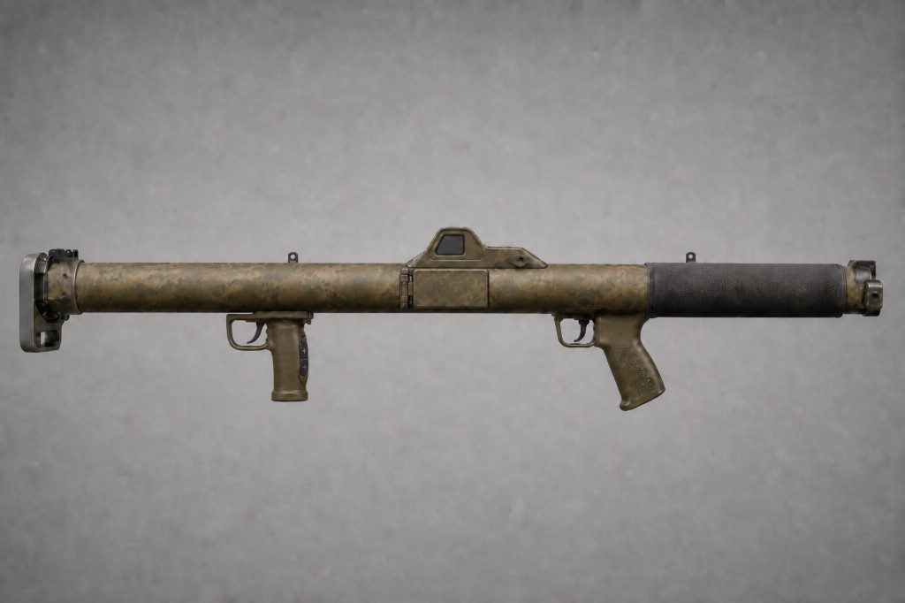

# RADR — Recoilless Anti-Drone Rocket

**Squad / SOF Mid-Range Drone Destroyer — 60 mm Class**

**RADR** is a lightweight, reusable **60 mm** shoulder-fired **recoilless** rocket system for **squad and SOF** — a **mid-range drone destroyer** that emphasizes **speed-to-target**, **simplicity (KISS)**, **reliability**, and **one-person reload**. It engages **Group 1–2** threats (FPV, quadcopters, loitering munitions, terrain-matching/gliding drones) as a **mid-range counter-UAS** weapon when machine guns fall short and SAM is too heavy to allocate.

**Status:** Phase 0 — Conceptual  
**Version:** 1.7.0

---

## Core Vision

The gunner **rough-aims** on a fold-out viewer fed by an integrated holo (**1.5×–4×**). Holding the **front trigger** powers the round’s **100 mm IR fire-and-forget** seeker and yields a **steady lock tone**; the **rocket retention stop** disengages only then. **Pulling the rear trigger** (while holding front) launches the **18-inch** round from a **ravioli-can style protective tube**. A **mildly progressive** solid motor drives closure to **~330–350 m/s** at **1000 m**. **Moderate-maneuver nose canards** trim the flight path; **four swept spring-loaded fins** deploy at exit and **mechanically lock** open. At **~20 ft**, **radar or millimeter-wave proximity** (with **timed backup**) fires a **pyrotechnic dispersal charge** that throws **300 × 7 mm** rough-edged dense alloy cubes in a **forward-biased cone** (~**10–12 ft** wide). The cubes kill — not a kinetic rod.

**Philosophy:** Speed is the primary defense · KISS + rugged · One-person reload · Honest capability ceiling.

**Launcher:** Modernized **M1 Bazooka** — **40 in** tube (≤ **5.5 kg** empty), matte camo, **Gustav-style flip breech** (spring bolt + positive deadbolt lock), **dual pistol-style triggers** (front slightly smaller; **+ / −** zoom on foregrip aft face), **no shoulder stock**, **slightly rear-biased** balance.

---

## Primary Threats

| Threat class | Examples / notes |
|--------------|------------------|
| **FPV kamikaze drones** | Close-in attack profiles; high closure rate |
| **Small-to-medium quadcopters** | ISR, spotter, and light attack platforms |
| **Loitering munitions** | Orbiting or diving engagement profiles |
| **Terrain-matching / GPS-denied gliders** | Low-signature glide profiles (e.g. Hornet / “Martian” class) |
| **Group 1–2 UAS (general)** | Swarm and interdiction attacks in the close fight |

RADR is **not** sized for large Group 3+ platforms or long-range aircraft.

---

## Locked Specifications

| Item | Spec | Status |
|------|------|--------|
| **Role** | Mid-range drone destroyer; squad / SOF mid-range counter-UAS | Locked |
| **Caliber** | **60 mm** | Locked |
| **Rocket length** | **18 in (457 mm)** maximum | Locked |
| **Launcher length** | **40 in (1016 mm)** | Locked |
| **Rocket mass (target)** | **≤ 3.5 kg** | Locked |
| **Launcher empty mass (target)** | **≤ 5.5 kg** | Locked |
| **Warhead** | **300 × 7 mm** dense alloy **rough-edged** cubes | Locked |
| **Dispersal** | **Pyrotechnic dispersal charge** — forward-biased cone **~10–12 ft** wide @ **~20 ft** | Locked |
| **Fuze** | **Radar or mm-wave proximity** (primary) + **timed backup** | Locked |
| **Seeker** | **100 mm IR** fire-and-forget | Locked |
| **Guidance** | **Moderate-maneuver**; small movable **canards near nose** | Locked |
| **Fins** | **4** swept **spring-loaded** at base; deploy on exit; **mechanical lock** once deployed | Locked |
| **Motor** | Mildly progressive solid; **2950–3050 N·s**; **~3.3 s**; **750–850 N** → **1050–1150 N** peak; **~330–350 m/s** @ 1000 m | Locked |
| **Range goal** | **1000 m** effective | Locked |
| **Backblast** | **≤ 10 yards (30 ft)** | Locked |
| **Protective tube** | **Ravioli-can style** robust tube + **manual pull-off cap** (soldier removes on load) | Locked |
| **Breech** | **Gustav-style flip**; spring-loaded bolt + **positive mechanical lock** (bolt-action feel) | Locked |
| **Controls** | **Front** = seeker + audible tone; **rear** = fire (front held) | Locked |
| **CoG** | **Slightly rear-biased** (comfortable shouldering) | Locked |
| **Rocket retention stop** | Bore stop when slung; releases only: breech closed + front held + lock tone | Locked |
| **Sight / power** | Integrated holo **1.5×–4×**; fold-out **~4 in** viewer; grip battery | Locked |

---

## Safety (Layers)

| Layer | Function |
|-------|----------|
| **Rocket retention stop** | Mechanical stop in barrel prevents round sliding forward when slung or carried; **disengages** only when breech is **fully closed**, gunner **holds front trigger**, and seeker outputs **steady lock tone**; **re-engages** if front is released |
| **Breech deadbolt** | Positive mechanical lock when closed — no seeker or retention release until tube seated |
| **Dual-trigger interlock** | Rear fire blocked until lock tone; front must stay held through ignition |
| **No override** | No rear fire without tone; no seeker until tube seated |
| **Backblast discipline** | ≤ **10 yd (30 ft)** cleared to rear before every shot and before breech re-open |

---

## Operational Sequence (Locked)

1. **Open breech** — pull spring-loaded bolt handle and swing breech open  
2. **Remove cap** from ravioli-can style protective tube  
3. **Insert tube** into launcher bore until seated  
4. **Close breech** — release bolt handle; breech **auto-locks** (deadbolt snap)  
5. **Hold front trigger** — seeker activates; **audible lock tone**; retention stop **disengages**  
6. **Pull rear trigger** while holding front → **rocket fires** (recoilless vent ≤ 10 yd rear)  
7. **Open breech** — empty protective tube **drops out** for reload  

**Carry:** Launcher + one round ≤ **9.0 kg** — one person can reload. Retention stop **engaged** whenever front trigger is not held.

**Authoritative detail:** [Annex F — Gunner sequence](annexes/F-employment-and-breech.md#loading-and-firing--gunners-sequence) · [Breech](annexes/F-employment-and-breech.md#breech-mechanism) · [Retention stop](annexes/F-employment-and-breech.md#rocket-retention-stop) · [DOC-06 diagrams](docs/06-system-description.md#diagrams)

---

## Comparison Snapshot

| | RADR | Carl Gustaf M4 | FIM-92 Stinger |
|--|------|----------------|----------------|
| Role | Mid-range C-UAS | Multi-role | MANPADS |
| Launcher | ≤ 5.5 kg, 40 in | ~6.6 kg | ~15 kg |
| Round | ≤ 3.5 kg, 18 in | ~3.2 kg | ~10.1 kg |
| Guidance | IR F&F, moderate-maneuver | Unguided | High-agility IR |
| Range goal | 1000 m | ammo-dependent | 4000+ m |
| Backblast | 10 yd (30 ft) | ~60 m class | moderate |

Data: [`data/baseline_systems.json`](data/baseline_systems.json)

---

## Out of Scope (Removed Concepts)

Laser beam-riding · Launcher-tracked guidance · Kinetic penetrator rod · High off-boresight agility · General-issue every-rifleman distribution

---

## Document Map

| # | Document |
|---|----------|
| 01 | [Concept Overview](docs/01-concept-overview.md) |
| 02 | [Operational Requirements](docs/02-operational-requirements.md) |
| 03 | [Design Constraints](docs/03-design-constraints.md) |
| 04 | [CONOPS / Use Cases](docs/04-conops-use-cases.md) |
| 05 | [Key Design Trades](docs/05-key-design-trades.md) |
| 06 | [System Description](docs/06-system-description.md) |
| 07 | [Limitations and Risks](docs/07-limitations-and-risks.md) |
| 08 | [Layered Defense Integration](docs/08-layered-defense-integration.md) |

| Annex | Topic |
|-------|--------|
| A–E | [Baseline, KPPs, trades, stabilization, references](annexes/) |
| **F** | [Employment sequence & breech](annexes/F-employment-and-breech.md) |
| **G** | [Mass budget & CG](annexes/G-mass-and-center-of-gravity.md) |
| **H** | [Motor thrust curve](annexes/H-motor-progressive-burn.md) |
| **I** | [Performance modeling](annexes/I-performance-modeling.md) |
| **J** | [Warhead dispersal](annexes/J-warhead-dispersal.md) |

### Outreach

| Doc | Purpose |
|-----|---------|
| [One-pager](docs/RADR-one-pager.md) | Single-page concept summary |
| [Pitch deck outline](docs/pitch-deck-outline.md) | 8–10 slide structure |

---

## Open Questions

- Live-fire Pk at 1000 m by threat class (hover vs. crossing vs. glide)  
- Evolution Space grain geometry vs. measured backblast inside 10 yd zone (motor baseline locked; live-fire TBD)  
- Cube alloy finalization (dense Ti/steel baseline)  
- Retention stop mechanism detail (spring/cam vs. solenoid assist) — **function locked**  
- Fuze baseline down-select: **radar proximity** vs. **millimeter-wave proximity** (one primary per round)  

---

## License

MIT — see [LICENSE](LICENSE). Concept art and program content remain **notional**; see program notice in LICENSE.

Conceptual engineering study only. Performance figures are **notional** until tested. Not authorization for procurement or use.
