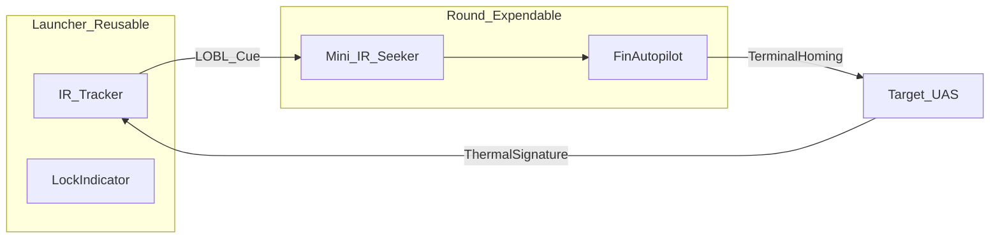

# Annex C — Design Trades Matrix

**Document ID:** TKI-30-66 / ANX-C  
**Version:** 0.3.0  
**Status:** Conceptual

Expanded discussion: [05 — Key Design Trades](../docs/05-key-design-trades.md)

---

## Trade Matrix

| Trade Area | Option A | Option B | Option C | Impact: Weight | Impact: Cost | Impact: Pk | Recommended |
|------------|----------|----------|----------|----------------|--------------|------------|-------------|
| **Caliber** | 40 mm | 50 mm ★ | 58–66 mm | B moderate | B moderate | C best KE | **50 mm** |
| **Backblast** | Countermass | Soft launch | Hybrid ★ | Hybrid mod | Hybrid mod | Preserves V | **Hybrid study** |
| **Launcher** | Disposable | Reusable + tracker ★ | — | Reusable heavier | Amortized | Equal | **Reusable + IR tracker** |
| **Design priority** | Cost-first | Performance-first | **Reliability-first ★** | — | — | — | **Reliability-first** |
| **Guidance** | Launcher IR + quad-cell round IR ★ | Imaging FPA | FMCW radar | B moderate | B ~$100–180 | B good | **Quad-cell + BIT** |
| **Seeker rejected** | ~~Imaging FPA~~ | ~~Radar~~ | ~~Rosette scan~~ | Fragile | Complex | Moving parts | **Not baseline** |
| **Pre-fire BIT** | None | Optional | **Mandatory ★** | +1–2 s | Minimal | Prevents duds | **Mandatory** |
| **Propulsion** | Max velocity | **Moderate ~650 m/s ★** | — | — | — | Lower shock | **~650 m/s** |
| **Payload** | Unitary rod ★ | Flechette pack | HE-frag | Similar | Similar | Rod best single | **Rod baseline** |
| **Stabilization** | Fins only | Rifling only | Rifling + fins ★ | Minimal add | Low | Best accuracy | **Rifling + fins** |
| **Team** | Solo gunner | Gunner + ammo bearer ★ | 3-man | — | — | Bearer enables ROE | **2-man** |
| **Seeker tier** | Quad-cell IR ★ | Micro-bolometer | Full imaging FPA | A lightest | A cheapest | C best | **Quad-cell / rosette (Phase 1)** |
| **Phase 2 seeker** | — | FMCW mini radar ★ | — | +200 g | +$150–250/rd | Better in obscuration | **Deferred variant** |

---

## Guidance Architecture Detail

**Reliability-first:** Mandatory BIT, quad-cell seeker (no FPA/radar baseline), dual fin springs, field-replaceable tracker module, moderate propellant load.

**Why not imaging FPA or radar:** More failure modes per round; defeats "works every time" goal at squad scale.

---

## Open Trade Decisions

| Trade | Status | Decision Gate |
|-------|--------|---------------|
| Quad-cell vs. micro-bolometer seeker | Open | Phase 1 bench test vs. representative UAS |
| FMCW radar round variant | Deferred | Phase 2 if obscuration MOE required |
| Countermass vs. soft-launch ratio | Open | Phase 1 ballistic test |

---

## Related Documents

- [05 — Key Design Trades](../docs/05-key-design-trades.md)
- [06 — System Description](../docs/06-system-description.md)
