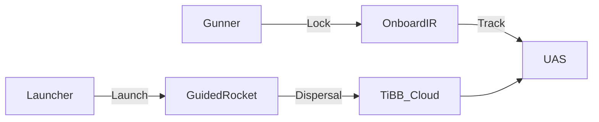

# Annex C — Trades Matrix

**Document ID:** TKI-30-66 / ANX-C  
**Version:** 0.4.0  
**Status:** Conceptual

See [05 — Key Design Trades](../docs/05-key-design-trades.md).

---

## Trade Matrix

| Trade | Option A | Option B | Option C | Recommended |
|-------|----------|----------|----------|-------------|
| **Philosophy** | Cost-first | Performance | **KISS / lightweight ★** | **KISS / lightweight** |
| **Payload** | Kinetic rod | HE-frag | **Ti BB flak ★** | **Ti BB flak** |
| **Guidance** | Beam-riding | Launcher-tracked | **Onboard IR F&F ★** | **Onboard IR F&F** |
| **Rocket length** | 12 in | **≤ 18 in ★** | > 18 in | **≤ 18 in max** |
| **Caliber** | 40 mm | **50 mm ★** | 66 mm | **50 mm** |
| **Dispersal** | Timed | **Proximity IR ★** | Seeker-gated | **Proximity IR (TBD)** |
| **Launcher** | Disposable | **Reusable breech ★** | — | **Reusable** |

---

## Removed from Baseline

| Item | Status |
|------|--------|
| Laser beam-riding | Rejected |
| Launcher tracker guidance | Removed |
| Pre-fire BIT | Removed |
| Kinetic rod | Removed |
| FMCW radar seeker | Not baseline |

---

## Architecture

---

## Related Documents

- [06 — System Description](../docs/06-system-description.md)
