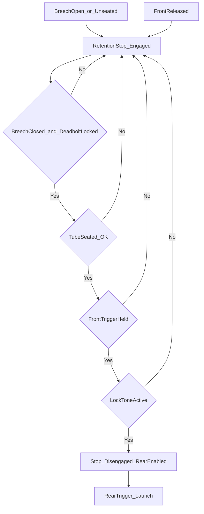
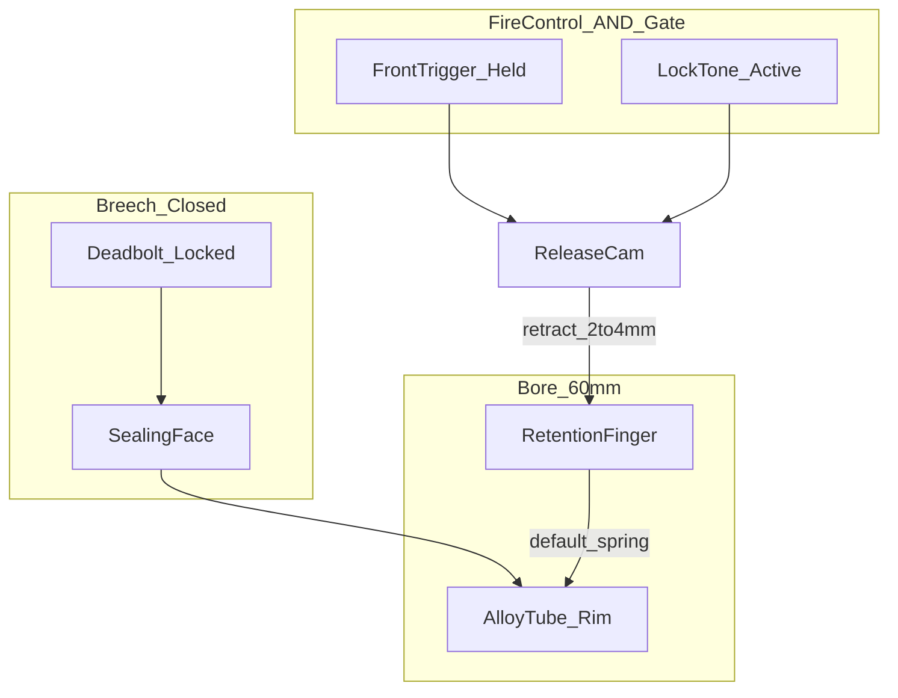
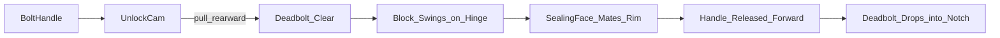
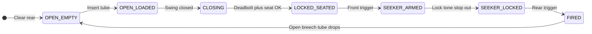
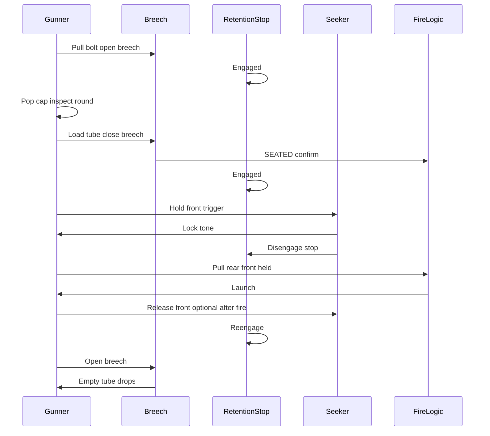

# Annex F — Employment Sequence and Breech Mechanism

**Document ID:** RADR / ANX-F  
**Version:** 1.8.0  
**Status:** Conceptual — locked baseline (notional until prototype)

Traceability: [06 — System Description](../docs/06-system-description.md) · [04 — CONOPS](../docs/04-conops-use-cases.md)

This annex is the **authoritative** reference for breech mechanics, the rocket retention stop, loading/firing sequence, interlocks, and abort rules. README and DOC-06 summarize here.

---

## Gunner’s Quick Reference (One Page)

| Step | You do | You hear / feel |
|------|--------|-----------------|
| 1 | **Pull** bolt handle back → **swing** breech open | Spring pressure; detent click |
| 2 | Prep round off-line; remove pull-tab cap | Cap separates clean |
| 3 | **Slide** tube into bore until rim seats | Light detent |
| 4 | **Swing** breech closed → **push** handle forward until **click** | Deadbolt snap; sealing face loaded |
| 5 | Hold **front** trigger → wait for **steady lock tone** | Tone = retention releases |
| 6 | **Rear** trigger — fire | Motor ignition; recoil through grips + **shoulder bar** + rear pad |
| 7 | Clear **10 yd** rear → open breech; spent tube drops | Spring return |

**Never:** hip fire; fire without lock tone; stand in rear arc during load or post-shot.

**Shoulder bar:** Forward **black sleeve** — [stowed](../visuals/launcher/output/radr-bazooka-authoritative-stowed.png) flush / [deployed 12→6](../visuals/launcher/output/radr-bazooka-authoritative-deployed.png). Spec: [SHOULDER-BAR-SPEC](../visuals/launcher/SHOULDER-BAR-SPEC.md).

---

## Controls (Locked)

| Control | Function | Interlock |
|---------|----------|-----------|
| **Front trigger** | Powers seeker search; **steady audible tone** = target lock / ready | Retention stop **disengages** only while front is held **and** tone is active |
| **Rear trigger** | Initiates launch (motor ignition) | **Blocked** until lock tone; **blocked** if front trigger released; **never** operates retention stop |
| **Zoom + / −** | **Smooth continuous 1×–20×** on fold-out display (digital sight) | On **aft face** of forward foregrip (buttons face rear); wired to sight + screen |

**Trigger form (locked):** Both triggers use the same **curved pistol-style trigger and guard**. The **front (foregrip) trigger is the same design, scaled slightly smaller** than the rear fire trigger.

**Support-hand ergonomics (right-handed gunner):** **Left index finger** on the front seeker trigger; **left thumb** on **+ / −** on the aft face of the foregrip — zoom without shifting the firing-hand grip on the rear pistol grip.

**Sighting (locked):** **Digital camera-style** sight — not a traditional look-down optic. Gunner uses the **fold-out display** at arm’s length (**RPG-style shouldering**); **no cheek weld** required. **Front trigger** = seeker + tone · **Rear trigger** = fire (front held + tone).

**Shoulder bar (locked):** **~12 mm** rod; hinge on **forward black sleeve**; [stowed](../visuals/launcher/output/radr-bazooka-authoritative-stowed.png) / [deployed 12→6](../visuals/launcher/output/radr-bazooka-authoritative-deployed.png). Recoil shared with motor + grips + launcher body. **Shoulder-fired.**

---

## Loading and Firing — Gunner’s Sequence

Seven phases from the gunner’s perspective. Each phase lists what you do, what you hear or feel, how the system responds, what is blocked, and what you must not do.

### Phase 1 — Clear the breech

| | |
|--|--|
| **Gunner action** | Pull the **spring-return bolt handle** rearward; swing the breech block open (~90°). Confirm the bore is clear; let any spent protective tube fall out. |
| **Hear / feel** | Handle moves against spring pressure (~15–25 mm); hinge swings freely; open detent holds block up. |
| **System response** | `BREECH_OPEN` — rear trigger disabled; seeker off; retention stop **engaged**. |
| **Interlock** | No seeker; no fire; rocket cannot translate forward in bore (stop engaged). |
| **Do not** | Stand in the **10 yd (30 ft)** rear danger zone; load with cap still on. |

### Phase 2 — Prepare the round

| | |
|--|--|
| **Gunner action** | Pull off the **alloy protective tube** pull-tab cap; visually inspect seeker dome and tube mouth. |
| **Hear / feel** | Cap separates cleanly; no tools. |
| **System response** | Round exposed **outside** launcher; not yet in bore. |
| **Interlock** | — |
| **Do not** | Force or pry cap; damage seeker dome; skip visual check. |

### Phase 3 — Load the tube

| | |
|--|--|
| **Gunner action** | Slide the protective tube into the bore until the rim seats on the sealing face (breech still open or closing). |
| **Hear / feel** | Light alignment detent as tube homes; no slam required. |
| **System response** | `OPEN_LOADED` → tube in bore, breech not locked. |
| **Interlock** | Seeker off; retention stop **engaged**. |
| **Do not** | Insert with cap on; slam tube; partial insert. |

### Phase 4 — Close and lock the breech

| | |
|--|--|
| **Gunner action** | Swing breech block closed; **release** bolt handle so the return spring drives it forward. |
| **Hear / feel** | **Deadbolt snap** — positive mechanical click; block cannot be opened without another deliberate pull on the handle. |
| **System response** | `LOCKED_SEATED` — pressure port and rim contacts confirm seat; seeker may be enabled; retention stop still **engaged**. |
| **Interlock** | Rear trigger blocked; fire blocked until lock tone. |
| **Do not** | Close on a misaligned tube; arm seeker before seat confirm. |

### Phase 5 — Arm the seeker (front trigger)

| | |
|--|--|
| **Gunner action** | Hold **front trigger**; rough-aim at threat within seeker envelope. |
| **Hear / feel** | Seeker cooling/search (notional); retention stop still blocks tube movement until tone. |
| **System response** | `SEEKER_ARMED` — acquiring; rear trigger **blocked**; retention stop **engaged**. |
| **Interlock** | Rear fire blocked; stop engaged until ready tone. |
| **Do not** | Pull rear trigger; snap-shot outside seeker FOV. |

### Phase 6 — Lock and fire

| | |
|--|--|
| **Gunner action** | Maintain aim until **steady lock tone**; while **holding front**, pull **rear trigger**. Keep front held through ignition. |
| **Hear / feel** | Steady tone = lock; retention stop releases (no forward creep under bump); launch pulse and rear vent. |
| **System response** | `SEEKER_LOCKED` → `FIRED` — retention stop **disengaged** with tone; motor ignites; recoilless exhaust vents rear. |
| **Interlock** | Rear enabled only with tone + front held; releasing front re-engages stop and blocks fire. |
| **Do not** | Release front during ignition; fire without tone; override interlocks. |

### Phase 7 — Clear and reload

| | |
|--|--|
| **Gunner action** | After safe interval, clear **10 yd** rear; pull bolt, open breech; empty tube drops. |
| **Hear / feel** | Tube falls free by gravity; breech opens on handle pull. |
| **System response** | `BREECH_OPEN_EMPTY` — retention stop **engaged**; seeker off. |
| **Interlock** | Ready for next cycle from Phase 1. |
| **Do not** | Re-open breech immediately after fire with rear zone occupied; reach into bore before rear is clear. |

---

## Detailed Sub-Steps (Reference)

| Step | Action | Expected feedback | Do not |
|------|--------|-------------------|--------|
| 1 | Pull spring bolt handle; swing breech ~90° open | Breech holds open on detent | Stand in backblast cone |
| 2 | Verify bore clear; eject spent tube if present | Empty bore | Load with cap on |
| 3 | Pull-off cap from alloy protective tube | Dome and cube pack visible | Force cap; damage dome |
| 4 | Slide tube into bore until fully home | Light detent feel | Slam tube; skip alignment |
| 5 | Swing breech closed; release bolt handle | **Deadbolt snap** — positive lock | Close without full insert |
| 6 | Wait for seat confirm (pressure + contacts) | Seat logic OK | Arm seeker if not seated |
| 7 | Hold **front trigger**; point at threat | Seeker search; stop **engaged** until tone | Fire rear without tone |
| 8 | Maintain aim until **audible lock tone** | Steady tone; stop **disengages** | Snap-shot off-boresight |
| 9 | While holding front, pull **rear trigger** | Launch + backblast | Release front during ignition |
| 10 | Hold position until motor clears tube | Recoilless vent rear | Re-open breech immediately |
| 11 | Open breech; let empty tube fall | Tube drops free | Reach into bore without clear rear |

---

## Phase Overview (System States)

| Phase | Gunner action | System state | Interlocks |
|-------|---------------|--------------|------------|
| **CLEAR** | Open breech; ensure prior tube ejected | `BREECH_OPEN` | Rear disabled; stop **engaged** |
| **PREP** | Pull off cap; inspect round | Round exposed, out of bore | — |
| **LOAD** | Insert tube; begin close | `BREECH_CLOSING` / `OPEN_LOADED` | Stop **engaged** |
| **SEAT** | Close breech; deadbolt locks | `LOCKED_SEATED` | Seeker off until seated |
| **ARM** | Hold front trigger; wait for tone | `SEEKER_ARMED` | Rear blocked; stop **engaged** |
| **READY** | Lock tone active (front held) | `SEEKER_LOCKED` | Rear enabled; stop **disengaged** |
| **FIRE** | Pull rear while holding front | `FIRED` / launch | Front must stay held |
| **POST** | Open breech after safe interval | `BREECH_OPEN_EMPTY` | Clear 10 yd rear |

---

## Interlocks (Logic Baseline)

| Condition | Front trigger | Rear trigger | Seeker | Retention stop |
|-----------|---------------|--------------|--------|----------------|
| Breech open | Disabled | Disabled | Off | **Engaged** |
| Breech closed, not seated | Disabled | Disabled | Off | **Engaged** |
| Seated, front not held | Enabled | **Blocked** | Standby | **Engaged** |
| Seated, front held, no lock tone | Active | **Blocked** | Acquiring | **Engaged** |
| Seated, front held, lock tone | Held | **Enabled** | Locked | **Disengaged** |
| Front released | — | **Blocked** | Off / standby | **Re-engages** |
| After fire | Disabled until CLEAR | Disabled | Off | **Engaged** |

---

## Safety Interlock Flow



---

## Rocket Retention Stop

### Purpose

The retention stop prevents the loaded rocket (inside its protective tube) from sliding **forward** in the smoothbore when the launcher is **slung, carried, or bumped**. It provides a **mechanical carry-safe default** that does not depend on battery state or software alone.

Typical failure modes without a stop: tube creep toward muzzle on sling transition, muzzle-down carry, or movement before engagement — risking misalignment, damaged rim contacts, broken seeker dome clearance, or unintended forward displacement into the muzzle brake zone.

### Physical location and what it blocks

| Item | Detail |
|------|--------|
| **Where** | Inside the **60 mm smoothbore**, in a **fixed pocket** in the lower bore wall, **forward of the breech sealing face** and **aft of the tube’s forward travel limit** |
| **Orientation** | **Radial finger** — protrudes inward toward bore centerline (~2–3 mm intrusion at tip) |
| **Contact** | Hardened pad bears on the **aft external shoulder** of the seated alloy tube (the rim step just forward of the breech interface) |
| **Blocked motion** | **Forward translation** of the tube+rocket assembly along the bore (toward muzzle). Does **not** block rearward ejection when breech opens |
| **Independent of** | Breech hinge angle (except interlock logic); rear trigger; launcher optics |

When the tube is seated and the breech is closed, the tube rim is clamped between the **breech sealing face** (rear) and the **retention finger** (forward on the shoulder). The finger is the anti-slide element; the breech block is the anti-rearward / gas-seal element.

### Side view (notional)

```
  muzzle ─────────────────────────────────────────────►

       [==== tube wall ====]
              │
    sealing   │   ○ finger (radial, ~2–3 mm into bore)
    face ◄────┼───┤
              │   └── bears on tube **aft shoulder** (rim step)
       [rim]──┘
```

### Retention vs breech — state timeline

| Event | Breech | Retention finger | Reset note |
|-------|--------|------------------|------------|
| Gunner opens breech | `BREECH_OPEN` | **Engaged** | **Reset on breech open** — cam de-energized; finger spring-return |
| Tube inserted, breech closing | Closing | **Engaged** | — |
| `LOCKED_SEATED` | Closed + deadbolt | **Engaged** | — |
| Front + lock tone | Closed | **Retracted** | Cam driven |
| Fire / front released | Closed or opening | **Engaged** | Immediate re-engage if tone lost |
| Post-shot open | `BREECH_OPEN` | **Engaged** | Spent tube drops; ready for reload |

### Baseline mechanism (locked concept)

| Element | Description |
|---------|-------------|
| **Stop body** | Spring-biased **radial bore finger** (hardened insert) projecting into the bore path |
| **Contact surface** | Bears on the **aft shoulder** (rim region) of the seated protective tube |
| **Default state** | **Engaged** — spring force holds finger in contact |
| **Retract** | Finger withdraws flush to bore wall only when **release cam** is driven by fire-control interlock |
| **Rear trigger** | **Never** retracts the stop — launch permission only |

The release cam is driven only when **all** of the following are true:

1. Breech **fully closed** and deadbolt **locked** (`LOCKED_SEATED`).  
2. Gunner **holding front trigger**.  
3. Seeker reporting **ready** (steady lock tone).

### Engage and disengage (cause → effect)

| Event | Stop | Reason |
|-------|------|--------|
| Breech opened | **Engaged** | Load/clear; block in-bore movement |
| Breech closed, not seated | **Engaged** | Tube position not confirmed |
| Seated, front trigger released | **Engaged** | Safe carry / sling |
| Seated, front held, no ready tone | **Engaged** | Seeker not cleared to fire |
| Seated, front held, **ready tone** | **Disengaged** | All release conditions met |
| Front trigger released (any time) | **Re-engages** | Immediate — before rear can matter |
| After fire; breech opened | **Engaged** | Reset for next cycle |

Opening the breech clears the mechanical load path; stop returns to **engaged** when breech is open.

### Mechanical integration (breech ↔ retention stop)



| Interface | Behavior |
|-----------|----------|
| **Breech open** | Stop **engaged**; release cam **cannot** energize (interlock open circuit) |
| **Breech closed + deadbolt** | Stop may still engage — tube rim captured on sealing face |
| **Front + tone** | Solenoid/linkage rotates **release cam**; finger retracts **~2–4 mm** flush to bore wall |
| **Rear trigger** | **No mechanical path** to cam — electrical launch enable only |

**Cross-section (conceptual):** Radial finger (~6–8 mm wide contact on tube aft shoulder) projects from a pocket in the lower bore wall. Return spring **~8–12 N** at finger tip keeps engagement. Cam profile lifts finger against spring when all AND conditions true.

### How disengagement works (front trigger + seeker tone)

Disengagement is **not** manual. The gunner does not flip a separate stop lever.

| Step | Gunner / system | Stop physical state |
|------|-----------------|---------------------|
| 1 | Breech closed, deadbolt snapped, tube seated | Finger **engaged** on shoulder (spring force) |
| 2 | Gunner **presses front trigger** (seeker powers) | Finger **still engaged** — search phase |
| 3 | Seeker achieves lock; **steady tone** in grip | Fire-control asserts `SEEKER_LOCKED` |
| 4 | Interlock energizes **release cam actuator** (solenoid or rotary solenoid on linkage) | Cam rotates **~15–25°** |
| 5 | Cam lobe lifts finger carrier against return spring | Finger retracts **~2–4 mm** into pocket — **flush with bore wall** |
| 6 | Tube shoulder clears finger; round free to accelerate on fire | Stop **disengaged** while tone + front held |
| 7 | Front trigger **released** (or tone lost) | Cam de-energizes; spring drives finger **re-engaged** immediately |

**Rear trigger:** Closes ignition circuit only. It has **no** mechanical linkage to the finger. If tone is active but front is released, the stop re-engages **before** rear input can matter.

**Breech open:** Interlock forces cam to safe position; finger **engaged** regardless of trigger state.

### Integration with breech (mechanical + logical)

| Breech state | Retention stop | Why |
|--------------|----------------|-----|
| Open | **Engaged** | No tube capture; prevent any partial insert creep |
| Closing / closed, not locked | **Engaged** | Rim not yet confirmed on sealing face |
| `LOCKED_SEATED` | **Engaged** (default) | Safe until arm sequence complete |
| `SEEKER_LOCKED` | **Disengaged** | All AND conditions met |
| After fire, breech opened | **Engaged** | Spent tube drops; bore clear for reload |

The breech **deadbolt** and retention **finger** solve different problems: deadbolt prevents block blow-open; finger prevents in-bore forward slide during carry.

### Failure modes

| Failure | Symptom | Safe default |
|---------|---------|--------------|
| Tube creep when slung | Stop engaged — blocks forward slide | Stop engaged |
| Partial seat / no `SEATED` | Tone blocked; stop engaged | Rear blocked |
| Tone dropout while holding front | Stop re-engages; rear blocked | Immediate |
| Breech not fully locked | Stop engaged; seeker off | No fire |

---

## Breech Mechanism

Gustav **heritage** flip breech with RADR **spring bolt handle**, **unlock cam**, and **positive deadbolt**. Notional mechanical description — not production CAD.

### Assembly overview (rear of launcher)

The breech is a **rear-hinged flip block** that replaces the M1 Bazooka wire tailcap. Major pieces:

1. **Breech block** — steel housing with **bore sealing face**, **recoilless vent passages**, and **rim contact pads**  
2. **Hinge axis** — pin through launcher rear lugs; block swings **~90°** down for loading  
3. **Bolt handle** — external lever on the right side of the block (mirrors bolt-action rifles visually)  
4. **Handle return spring** — compression spring in the grip housing pushes handle **forward** when released  
5. **Unlock cam** — internal plate tied to handle; lifts deadbolt when handle pulled **rearward**  
6. **Deadbolt detent** — hardened pin or cam nose that drops into a **machined notch** in the launcher receiver when handle is forward  



### How the spring-loaded bolt works

| Phase | Handle position | Internal mechanics |
|-------|-----------------|-------------------|
| **Locked (carry/fire-ready)** | Handle **full forward** against receiver stop | Deadbolt engaged in notch; unlock cam relaxed; block cannot pivot |
| **Unlock (gunner pull)** | Handle moves **15–25 mm aft** against spring | Unlock cam rotates; cam face lifts deadbolt **~2–3 mm** clear of notch; pivot unlocked |
| **Open** | Handle held aft or released mid-swing | Block rotates on hinge; **open detent** ball catches block at ~90° |
| **Close** | Gunner swings block up | Sealing face approaches tube rim; alignment taper guides rim |
| **Re-lock** | Gunner releases handle | Return spring drives handle forward; deadbolt rolls/slides into notch with **audible snap** |

The gunner **never** rotates a separate safety tab — the **bolt handle is the primary manual safety** for breech opening, similar in muscle memory to a rifle bolt.

### Force and travel (order-of-magnitude — notional)

| Element | Travel / force | Notes |
|---------|----------------|-------|
| Bolt handle | **15–25 mm** aft pull | ~25–40 N against return spring |
| Deadbolt lift | **2–3 mm** | Unlock cam mechanical advantage |
| Handle return spring | **~30–50 N** at full stroke | Notional; production tune for one-hand close |
| Retention finger spring | **~8–12 N** at tip | Radial engagement on tube shoulder |
| Release cam stroke | **~15–25°** rotation | Solenoid or mechanical cam — TBD |

### How the breech locks when closed

Locking is **mechanical positive stop**, not friction alone:

| Lock element | Function |
|--------------|----------|
| **Deadbolt into receiver notch** | Prevents block from pivoting open under launch pressure or sling bumps |
| **Sealing face compression** | O-ring or crush gasket line on tube rim — gas seal for recoilless event |
| **Rim electrical contacts** | Spring pins wipe on tube rim only when fully seated |
| **Pressure port** | Transducer sees bore pressurization only when tube seals |

Until the deadbolt snaps, the fire-control treats the weapon as **not seated** (`CLOSING` state). Seeker power and retention release remain blocked.

### User feel (bolt-action style)

| Sensation | Meaning for the gunner |
|-----------|------------------------|
| **Spring resistance** on first pull | You are defeating the return spring — not yet open |
| **Small click** mid-travel | Deadbolt cleared — block is free to swing |
| **Detent at full open** | Hands-free loading — block stays up |
| **Solid thunk on close** | Sealing face met rim — alignment good |
| **Sharp snap on handle release** | Deadbolt locked — same certainty as a rifle bolt closing |
| **No snap** | Do not arm — check seating; retention stop stays engaged |

The intended emotional model: **“closed” is not enough — “snapped” is closed.**

### Operating principle

| Step | Mechanism | Result |
|------|-----------|--------|
| **Unlock** | Gunner pulls **bolt handle** rearward (~15–25 mm) against a compression spring | **Unlock cam** lifts **deadbolt detent** off breech block |
| **Open** | Block pivots **~90°** on rear **hinge axis** | Bore and recoilless vent exposed; detent holds block open |
| **Load** | Alloy protective tube (cap removed) slides in until **rim seats** on **sealing face** | Tube aligned for contacts and pressure port |
| **Close** | Block swung forward; sealing face mates tube rim | Bore closed mechanically |
| **Lock** | Gunner **releases** handle; return spring drives handle forward | **Deadbolt cam** drops into machined detent — **positive stop** |
| **Confirm** | Pressure transducer + rim electrical contacts | `SEATED` asserted — gates seeker and retention logic |

The breech cannot return to open until the gunner performs another deliberate **pull** on the bolt handle. There is no passive unlock from recoil or vibration alone.

### Operator feel

- **Pull:** Distinct spring resistance on bolt handle; short travel before cam clears deadbolt.  
- **Open:** Smooth hinge swing; block stays up on detent without holding.  
- **Close:** Positive alignment as sealing face meets tube rim.  
- **Lock:** Audible and tactile **deadbolt snap** — bolt-action certainty; block feels **locked**, not merely closed.  
- **Certainty:** Weapon is not in a fire-ready state until snap, seat confirm, front trigger, and lock tone — in that order.

### Components

| Component | Function | Interaction order |
|-----------|----------|-------------------|
| **Flip breech block** | Closes bore; sealing face; rim contacts | Moves on hinge after unlock |
| **Hinge axis** | Rear pivot; ~90° open | Fixed to launcher rear |
| **Spring-return bolt handle** | Unlock input; returns forward to lock | **First** — pull before swing |
| **Unlock cam** | Lifts deadbolt when handle pulled | With handle travel |
| **Deadbolt detent / cam** | Positive lock when closed | **Last** — snaps on handle release |
| **Bore sealing face** | Gas seal at launch; tube rim interface | Mates on close |
| **Rim electrical contacts** | Seeker power/signal when seated | After close + lock |
| **Pressure transducer port** | Confirms seated / bore condition | After close + lock |
| **Recoilless vent path** | Rearward blast per 10 yd zone | Through block / launcher rear |
| **Rocket retention stop** | Bore finger; spring-default engaged | Independent of hinge; gated by interlock |

### Heritage: M1 Bazooka and Carl-Gustaf

RADR keeps the **long-tube, rear-load** operator model familiar from the **M1 Bazooka**, but replaces the WWII **wire rear cage** with a **compact flip block** and **deadbolt**. Loading follows the **Carl-Gustaf** pattern (open rear, insert round container, close, fire), but RADR uses a **sealed alloy protective tube** at **60 mm / 40 in** scale — not a bare HEAT round and not an 84 mm crew-served mass class.

### Breech state machine



| State | Description | Transitions |
|-------|-------------|-------------|
| `OPEN_EMPTY` | Breech open; bore clear or spent tube ejected | → `OPEN_LOADED` on insert |
| `OPEN_LOADED` | Tube in bore; breech not locked | → `CLOSING` on swing shut |
| `CLOSING` | Block closing; deadbolt not latched | → `LOCKED_SEATED` on snap + sensors |
| `LOCKED_SEATED` | Deadbolt locked; seated; stop engaged | → `SEEKER_ARMED` on front trigger |
| `SEEKER_ARMED` | Seeker on; awaiting tone; stop engaged | → `SEEKER_LOCKED` on tone |
| `SEEKER_LOCKED` | Tone active; stop disengaged | → `FIRED` on rear pull |
| `FIRED` | Post-launch venting | → `OPEN_EMPTY` after safe open |

### Operator mechanical sequence (breech only)

1. **Unlock:** Pull bolt handle (compress return spring; unlock cam clears deadbolt).  
2. **Open:** Swing block ~90° on hinge.  
3. **Load:** Insert alloy protective tube (cap already removed).  
4. **Close:** Swing block to closed; sealing face mates rim.  
5. **Lock:** Release handle; deadbolt cam engages — **snap**.  
6. **Confirm:** Pressure + contacts → `SEATED`.  
7. **Arm / fire:** Per gunner sequence and interlocks above.

---

## Employment Sequence Diagram



---

## Abort and Safety Rules

- **No rear trigger** without steady lock tone.  
- **No seeker activation** until `LOCKED_SEATED` (pressure + contacts).  
- **Retention stop engaged** unless breech closed, locked, seated, front held, and ready tone active.  
- **Releasing front trigger** re-engages stop and blocks rear fire immediately.  
- **Rough aim** required — not high off-boresight.  
- **10 yards (30 ft)** minimum cleared to rear before every shot and before breech re-open after fire.  
- If lock tone fails: release front (stop re-engages), re-aim or reposition; do not override with rear trigger.

---

## Notional Timing (Trained Gunner)

| Milestone | Target (notional) | KPP reference |
|-----------|-------------------|---------------|
| Tube in bore → seated | ≤ 10 s | Reload discipline |
| Seated → lock tone | ≤ 15 s | Time to first shot (objective) |
| Lock tone → fire | ≤ 3 s | Gunner decision |
| Fire → breech open for reload | ≤ 15 s | Post-shot SOP |

*Not validated in trials.*

---

## Open Questions (Mechanical)

- **Retention release:** Solenoid-driven cam vs. purely mechanical linkage from front trigger — down-select for battery-off safe default.  
- **Materials:** Breech block alloy (steel vs. investment cast) and finger insert hardness vs. tube shoulder wear.  
- **Tolerance stack:** Rim seat, finger intrusion, and deadbolt notch depth — prototype gauge set TBD.

---

## Related Documents

- [06 — System Description](../docs/06-system-description.md) — Diagrams and summaries  
- [G — Mass and CG](G-mass-and-center-of-gravity.md)  
- [D — Stabilization](D-projectile-stabilization.md)
