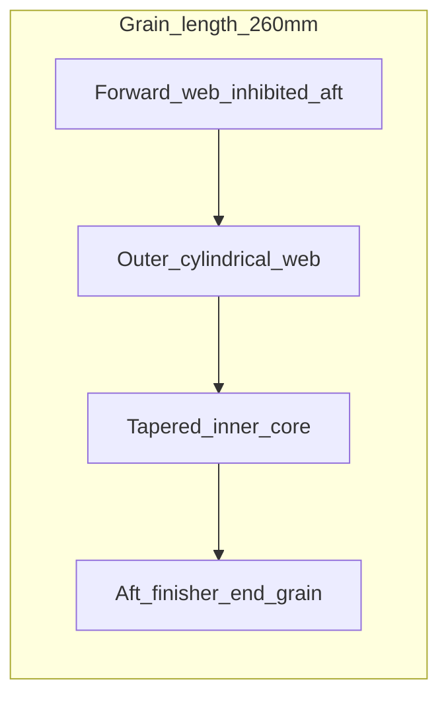

# Annex H — Motor Progressive Burn Profile

**Document ID:** RADR / ANX-H  
**Version:** 1.8.0  
**Status:** Conceptual — **final motor baseline locked** (notional ballistics until live-fire)

*Thrust-time table supports design trades; impulse and velocity bands are analytic targets — not demonstrated test data.*

Traceability: [06 — System Description](../docs/06-system-description.md) · [05 — Key Design Trades](../docs/05-key-design-trades.md)

---

## Motor Summary (Locked Baseline)

| Parameter | Value |
|-----------|--------|
| Type | **Solid rocket motor** — **mildly progressive** grain |
| Propellant | **Evolution Space high-rate tactical** propellant (baseline selection) |
| Signature | **Low-signature where possible** (smoke/plume reduction goal — not zero signature) |
| Motor bay length | ~297 mm |
| Usable grain length | ~260 mm |
| Propellant mass | ~1.20 kg |
| **Burn time** | **~3.3 s** |
| **Total impulse** | **2950–3050 N·s** (nominal **~3000 N·s**) |
| **Initial thrust** | **~750–850 N** (first **1–2 s**) |
| **Peak thrust** | **~1050–1150 N** |
| **Est. velocity @ 1000 m** | **~330–350 m/s** |
| Range envelope | **200 m** min · **800–1200 m** · **1000 m** sweet spot · **1200 m** max |

**Assessment:** Solid, achievable target for a **60 mm × 18 in** round within recoilless **10 yd** backblast SOP and squad carry mass.

---

## Grain Behavior (Mildly Progressive)

| Segment | Duration | Thrust | Purpose |
|---------|----------|--------|---------|
| **Low plateau** | **~0–2 s** | **~750–850 N** | Lower initial thrust → manageable recoilless backblast and shoulder impulse |
| **Ramp** | **~2.0–3.0 s** | Rises toward peak | Closure speed for **1000 m** engagement |
| **Tail** | **~3.0–3.3 s** | **~1050–1150 N** peak, then burnout | Terminal velocity build; motor tail-off |

**Not selected:** Boost-first grains (excess peak pressure for 10 yd rear SOP); neutral-burn grains (higher initial peak, less backblast margin).

---

## Grain Geometry Approach (Conceptual)

Notional **dual-layer progressive** grain inside the **~260 mm** usable length — no production CAD.

| Layer / feature | Burn surface driver | Thrust effect |
|-----------------|---------------------|---------------|
| **Forward low-rate segment** | **Outer cylindrical web** + inhibited aft face | **750–850 N** plateau — limits initial port area → **10 yd backblast** margin |
| **Mid ramp** | **Tapered inner core** opens as outer web regresses | Port area grows → pressure rises **870 → 1000 N** |
| **Aft tail / finisher** | **End-burning sliver** or thin **end grain** | Peak **1050–1150 N** without boost-first spike |

**Which surfaces drive the profile:**

- **Low plateau (0–2 s):** Dominated by **restricted port** — small burning perimeter, thick web ahead of the core.  
- **Ramp (2–3 s):** **Core surface area** increases as outer web thins — mildly progressive, not neutral.  
- **Tail (3–3.3 s):** **Aft grain face** contributes last impulse before burnout.

### Grain sketch (notional cross-section)

Case **60 mm OD** · usable grain **~260 mm** (motor bay ~297 mm). Nose of round to the left.



| Region | Burning driver | Thrust phase |
|--------|----------------|--------------|
| Forward | Thick web, small port | **750–850 N** plateau 0–2 s |
| Mid | Core opens as web regresses | Ramp **870–1000 N** |
| Aft | End face / thin sliver | Peak **1050–1150 N** tail |

ASCII (side cut, not to scale):

```
NOSE |....[==== inhibited web ====|== outer cyl ==|<> core <>|# fin #]| TAIL
      |<-------- ~260 mm usable grain ------------------------------->|
```

### Manufacturing and margin

| Check | Notional | Action if out of band |
|-------|----------|------------------------|
| Impulse integration vs table | **~2910–3000 N·s** | Adjust web thickness or propellant load |
| Peak pressure vs case | Within 60 mm aluminum case rating | Reduce tail segment area |
| Burn time | **3.3 ± 0.1 s** | Core length / inhibitor tweak |

Script traceability: thrust table in [`radr_trajectory.py`](../scripts/radr_trajectory.py) scaled to **3000 N·s**; burnout band cross-check in [Annex I](I-performance-modeling.md).

---

## Propellant Choice (Evolution Space)

RADR uses a **solid grain** sized for a **60 mm × 18 in** round, not a liquid or hybrid system — **KISS** for squad logistics and field reliability.

| Factor | Rationale |
|--------|-----------|
| **Evolution Space high-rate tactical propellant** | Supports **controlled pressure rise** in the ramp while preserving a **low-thrust opening segment** |
| **Mildly progressive grain geometry** | First **1–2 s** at **750–850 N** → backblast margin; then ramp to **1050–1150 N** peak |
| **Low-signature goal** | Reduce visual/thermal launch signature **where chemistry allows** without sacrificing the 1000 m closure target |

---

## Thrust-Time Profile (Notional — Matches Locked Bands)

Mildly progressive burn: **lower thrust 0–2 s**, **ramp 2–3.0 s**, **peak and tail to ~3.3 s**.

| Time (s) | Thrust (N) | Phase |
|----------|------------|--------|
| 0.0 | 0 | Ignition start |
| 0.5 | 780 | Low plateau |
| 1.0 | 800 | Low plateau |
| 1.5 | 820 | Low plateau |
| 2.0 | 870 | Ramp start |
| 2.5 | 1000 | Ramp |
| 3.0 | 1120 | Peak |
| 3.3 | 1050 | Burnout tail |

### Phase Averages (Design Check)

| Phase | Duration (s) | Avg thrust (N) | Impulse contrib. (N·s) |
|-------|--------------|----------------|------------------------|
| Low (0–2.0) | 2.0 | ~795 | ~1590 |
| Ramp (2.0–3.0) | 1.0 | ~995 | ~995 |
| Tail (3.0–3.3) | 0.3 | ~1085 | ~325 |
| **Total** | **~3.3** | **~910 avg** | **~2910** (within **2950–3050** pad) |

**Locked impulse band:** **2950–3050 N·s** — table integrates inside band with manufacturing tolerance.

---

## Why Mildly Progressive (Not Neutral / Boost-First)

| Profile | Recoil / backblast | Range at 1000 m | RADR fit |
|---------|-------------------|-----------------|----------|
| **Mildly progressive (low → ramp)** | Lower peak at launch | **330–350 m/s** class at 1000 m | **Selected** |
| Neutral burn | Higher initial peak | Moderate | Rejected — shoulder strain |
| Boost-first | Highest initial peak | Best short range | Rejected — 10 yd backblast SOP |

Low **750–850 N** initial thrust keeps the **10 yard (30 ft)** rear danger zone manageable; ramp to **1050–1150 N** peak delivers **~330–350 m/s** at **1000 m** (notional).

---

## Performance Bridge to 1000 m Goal

| Parameter | Locked / notional value | Basis |
|-----------|-------------------------|-------|
| Total impulse | **2950–3050 N·s** (~3000 nominal) | Thrust-time integration + band |
| Launch mass | ~3.1 kg | Annex G |
| Burn time | **~3.3 s** | Table above |
| Initial thrust | **750–850 N** | First 1–2 s segment |
| Peak thrust | **1050–1150 N** | Ramp peak |
| Time of flight @ 1000 m | ~4.5–5.0 s | Ballistic estimate |
| Terminal velocity @ 1000 m | **330–350 m/s** | Drag + impulse placeholder |

**Honest limit:** No live motor test with Evolution Space grain in this form factor. Numbers are the **locked design baseline**, not a demonstrated KPP until ballistic test.

---

## Vendor engagement packet (Evolution Space or equivalent)

Use [DOC-09 — Motor vendor brief](../docs/09-motor-vendor-brief.md) as the one-page attachment for email / NDA. Bring the **hard constraints** below; ask for measured data, not slide claims.

| Topic | Hard constraints (RADR locked) | Request from vendor |
|-------|----------------------------------|---------------------|
| Form factor | **60 mm** case OD, **~260 mm** grain, **~1.20 kg** propellant | Feasibility + case rating |
| Total impulse | **2950–3050 N·s** (nominal **3000**) | Static-fire \(I\) measurement |
| Opening segment | **750–850 N** for **~1–2 s** | Thrust-time first 2 s (backblast driver) |
| Peak / burn | **1050–1150 N** peak, **~3.3 s** burn | Full \(F(t)\), peak pressure |
| Profile | **Mildly progressive** — not boost-first | Grain concept sketch + regression plan |
| Backblast / plume | Recoilless **≤ 10 yd (30 ft)** rear SOP | Plume / blast data for opening thrust level |
| Deliverables | — | \(F(t)\), \(I\), \(P_\mathrm{max}\), grain CAD concept, hazard classification |
| Out of scope (call 1) | — | Full round integration, seeker, warhead |

**Pass criteria for vendor down-select:** measured impulse inside band **and** opening thrust compatible with 10 yd rear discipline **without** exceeding 60 mm case pressure limits.

---

## Related Documents

- [09 — Motor vendor brief](../docs/09-motor-vendor-brief.md)  
- [10 — Phase 1 prototype gates](../docs/10-phase-1-prototype-gates.md)  
- [I — Performance Modeling](I-performance-modeling.md)  
- [G — Mass and CG](G-mass-and-center-of-gravity.md)  
- [05 — Key Design Trades](../docs/05-key-design-trades.md)  
- [07 — Limitations and Risks](../docs/07-limitations-and-risks.md)
