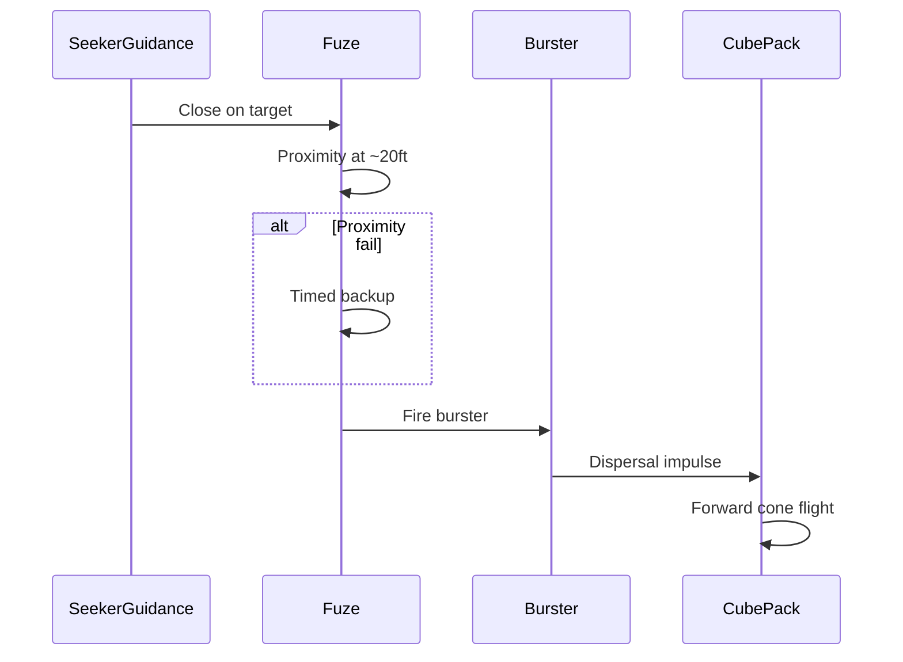

# Annex J — Warhead and Pyrotechnic Dispersal

**Document ID:** RADR / ANX-J  
**Version:** 1.8.0  
**Status:** Conceptual — high-level mechanism only (no energetics or live-fire data)

Traceability: [06 — System Description](../docs/06-system-description.md) · [03 — Design Constraints](../docs/03-design-constraints.md)

---

## Warhead Summary (Locked)

| Element | Spec |
|---------|------|
| Kill mechanism | **300 × 7 mm** dense alloy **rough-edged** cubes |
| Dispersal | **Pyrotechnic dispersal charge** (burster) — **not** a shaped charge penetrator |
| Pattern | **Forward-biased cone**, **~10–12 ft** wide at **~20 ft** standoff |
| Fuze | **Radar or mm-wave proximity** (primary) + **timed backup** |
| Role of burster | **Disperser only** — opens pack and biases cube velocity forward |

---

## Round Layout (Aft → Forward)

| Zone | Contents |
|------|----------|
| **Aft** | Motor, nozzle, fin roots |
| **Mid** | Cube pack in lightweight containment (fragmentation matrix) |
| **Forward of pack** | **Pyrotechnic dispersal charge** in annular / puck geometry |
| **Nose** | Seeker dome + fuze electronics forward of burster cavity |

The cube pack sits **aft of the burster** so gas pressure drives fragments **forward** through the open nose path and body liner, not back into the motor.

---

## Pyrotechnic Dispersal (Conceptual)

### Charge placement

- **Location:** Immediately **forward of the cube pack**, **aft of the seeker interface bulkhead**.  
- **Form:** Low-metal or inert-augmented **dispersal puck** (not HEAT liner).  
- **Initiation:** Fuze fires detonator → burster deflagrates/brisks rapidly (~milliseconds).

### Burster placement (axial — mm from nose)

| Element | From nose (mm) | Notes |
|---------|----------------|-------|
| Seeker dome tip | 0 | Reference |
| Fuze electronics | 70–95 | Proximity aperture forward |
| Forward bulkhead | **110** | Seals warhead bay |
| **Pyrotechnic burster puck** | **125–135** | Annular / puck — **forward of cube pack** |
| Cube pack centroid | **~165** | **300 × 7 mm** locked |
| Warhead casing aft edge | ~230 | Body transition |

### Timing chain (notional — ms scale)

| Stage | Delay (ms) | Event |
|-------|------------|--------|
| T0 | 0 | Proximity threshold crossed (~20 ft / 6 m) |
| T0 + 2–5 | — | Fuze confirms envelope; arms detonator |
| T0 + 8–15 | — | Detonator fires burster |
| T0 + 15–25 | — | Burster peak pressure in pack cavity |
| T0 + 25–40 | — | Cube ejection through nose path; forward cone forms |

**Backup timed fuze:** If proximity fails, fixed delay from launch based on [Annex I](I-performance-modeling.md) TOF — not synchronized to this table in v1.8 concept docs.

### Forward-biased cone mechanism

| Mechanism | Effect |
|-----------|--------|
| **Forward cavity / petal liner** | Directs primary gas and cube impulse **toward the nose** |
| **Partial confinement** | Body wall contains lateral expansion; **nose aperture** is the preferential exit |
| **Pack stacking** | Cubes loaded in columns biased slightly forward — natural ejection bias |
| **Standoff ~20 ft** | Proximity fuze triggers before impact — cone has room to open |

**Resulting pattern (notional):** Full cone half-angle ~**15–25°** at **~20 ft**, footprint **~10–12 ft** diameter — wide enough for Group 1–2 UAS but not a spherical omnidirectional frag field.

### What the burster does *not* do

- Does **not** penetrate armor or structure (no rod).  
- Does **not** replace cube kinetic energy — cubes carry terminal kill.  
- Does **not** rely on blast overpressure alone against hardened targets.

---

## Fuze Chain

| Step | Event |
|------|--------|
| 1 | IR seeker delivers impact point; fuze arms on launch |
| 2 | **Radar or mm-wave proximity** senses target envelope at **~20 ft (6 m)** |
| 3 | Burster initiates; cubes exit forward |
| 4 | If proximity fails, **timed backup** fires at predicted intercept time |

---

## KISS Boundaries

- One primary proximity path per round (radar **or** mm-wave — engineering down-select).  
- No command link, no midcourse retarget of burster.  
- No launcher video of cube pattern — gunner uses **digital sight display** + **lock tone** only pre-launch.

---

## Trade-Study: 275-Cube Pack @ 1200 m Stretch (Not Locked)

| Item | Locked baseline | Trade-study variant |
|------|-----------------|---------------------|
| Cube count | **300 × 7 mm** | **275 × 7 mm** |
| Pack mass (notional) | **~0.72 kg** | **~0.66 kg** (−~0.06 kg) |
| Range anchor | **1000 m** KPP | **1200 m** stretch only |
| Velocity @ range | **330–350 m/s @ 1000 m** | Script **~332 m/s @ 1200 m** with lighter round — see [Annex I](I-performance-modeling.md#1200-m-stretch-trade-study--not-locked) |

**Purpose:** Recover **~60 g** for slightly higher burnout / coast margin when analyzing **1200 m** closure — **does not** change the locked **300-cube** warhead for **1000 m** effectiveness.

**Forward cone:** Lighter pack may require **slightly tighter column bias** in the nose aperture; pattern width target (**~10–12 ft @ ~20 ft**) unchanged in concept.

---

## Related Documents

- [06 — Fuze and Kill Chain](../docs/06-system-description.md#fuze-and-kill-chain)  
- [G — Mass/CG](G-mass-and-center-of-gravity.md) (warhead mass split)
