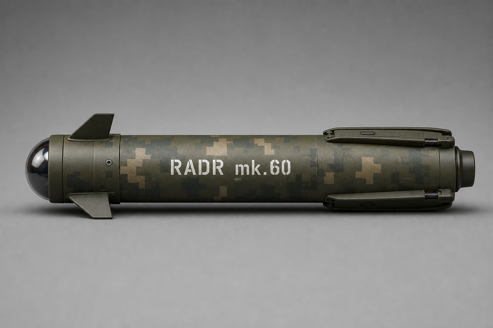

# 01 — Concept Overview

**Document ID:** RADR / DOC-01  
**Version:** 1.7.0  
**Status:** Conceptual — locked baseline

---

## Core Vision

**RADR** (Recoilless Anti-Drone Rocket) is a lightweight, reusable **60 mm** shoulder-fired **recoilless** **mid-range drone destroyer** for **squad and SOF**. It prioritizes **speed-to-target**, **reliability**, **KISS**, and **one-person reload** over high off-boresight agility or launcher-tracked guidance.

The round is an **18-inch (457 mm)** rocket (target **≤ 3.5 kg**) in an **alloy protective tube** (**tank-shell**: tube stays in launcher; rocket smaller than tube, flies free). Payload: **300 × 7 mm** dense alloy rough-edged cubes dispersed by a **pyrotechnic dispersal charge** in a **forward-biased cone** (~**10–12 ft** wide at **~20 ft**). **100 mm IR fire-and-forget** seeker with **moderate-maneuver nose canards**. **Radar or millimeter-wave proximity fuze** (timed backup). **Mildly progressive** solid motor: **2950–3050 N·s**, **~3.3 s** burn, **750–850 N** initial → **1050–1150 N** peak, **~330–350 m/s** at **1000 m**.

The launcher is **40 in**, **≤ 5.5 kg** empty, **Gustav-style flip breech**, dual triggers, **rocket retention stop**, **fold-down rounded shoulder bar** (stows flush; deploys **12→6**), integrated **digital sight (1×–20× smooth zoom)** + fold-out display — **RPG-style shouldering**, **no fixed shoulder stock**, **slightly rear-biased** CoG.

---

## Purpose

RADR engages **200 m** (minimum) through **1200 m** (maximum); **800–1200 m** is the primary mid-range band with **1000 m** as the design sweet spot — when organic machine guns lack reach and SAM systems are not appropriate. **Specialist** issue — teams that need **mid-range counter-UAS**, not every rifleman.

---

## Primary Threats

1. **FPV kamikaze drones**  
2. **Small-to-medium quadcopters**  
3. **Loitering munitions**  
4. **Terrain-matching / GPS-denied gliding drones** (e.g. Hornet / “Martian” class)  
5. **Other Group 1–2 UAS** — swarm and interdiction  

---

## Core Philosophy

| Principle | Application |
|-----------|-------------|
| **Speed-to-target** | Primary defense against evasion |
| **Moderate-maneuver guidance** | Rough aim + IR lock + nose-canard trim — not high OBA |
| **KISS + rugged** | Alloy tube; flip breech; dual-trigger |
| **Safety in depth** | Retention stop, breech lock, dual-trigger interlocks |
| **Mid-range flak** | Pyrotechnic dispersal → forward kill cone of cubes |
| **Honest** | 1000 m and Pk are goals until live fire |

---

## Locked Configuration

| Item | Value |
|------|--------|
| Caliber | **60 mm** |
| Rocket | **18 in (457 mm)**; **≤ 3.5 kg** |
| Launcher | **40 in**; **≤ 5.5 kg** empty |
| Warhead | **300 × 7 mm** dense alloy rough-edged cubes |
| Dispersal | **Pyrotechnic charge**; forward cone **~10–12 ft** @ **~20 ft** |
| Fuze | Radar or mm-wave proximity (primary) + timed backup |
| Seeker | **100 mm IR** F&F |
| Guidance | **Moderate-maneuver**; canards **near nose** |
| Fins | **4** swept spring-loaded at **base**; **mechanical lock** when deployed |
| Motor | Mildly progressive; **2950–3050 N·s**; **~3.3 s**; **750–850 → 1050–1150 N**; **330–350 m/s** @ 1000 m |
| Range | **200 m** min · **800–1200 m** · **1000 m** sweet spot · **1200 m** max |
| Backblast | **≤ 10 yd (30 ft)** |
| Tube | **Tank-shell** alloy tube — PULL pop top; screw bottom in bore; foil continuity |
| Breech | Gustav flip + spring bolt + positive lock |
| Controls | Front = seeker/tone; rear = fire (front held) |
| Retention stop | Engaged unless closed breech + front held + lock tone |
| CoG | Slightly rear-biased |
| Sight | **Digital cam sight**; **smooth 1×–20×**; fold-out **~4 in** display; foregrip **+ / −** (wired) |

---

## Launcher Concept (Locked Silhouette)

Modernized **M1 Bazooka**: **40 in** matte multicam tube; **forward foregrip** (seeker trigger + **+ / −** zoom wired to sight/display); **rear pistol grip**; padding grip→breech only; **integrated digital sight** feeding **fold-out ~4 in** display (stows flush). **RPG-style** aim — no cheek weld.

## Round (locked art)

18 in round · fins stowed for tube clearance · [ROUND-SPEC](../visuals/rocket/ROUND-SPEC.md) · container [CONTAINER-SPEC](../visuals/rocket/CONTAINER-SPEC.md).

---

## Operational Sequence (Locked)

1. Open breech (pull spring bolt, swing open)  
2. Pop top (PULL) on tube  
3. Slide tube into launcher  
4. Unscrew bottom cap in bore  
5. Close breech → rocket ready (continuity)  
6. Hold front trigger → seeker + tone (retention stop disengages)  
7. Pull rear trigger while holding front → rocket flies free  
8. Open breech → spent tube drops out  

**Annexes:** [F — Employment](../annexes/F-employment-and-breech.md) · [G — Mass/CG](../annexes/G-mass-and-center-of-gravity.md) · [H — Motor](../annexes/H-motor-progressive-burn.md)

---

## What RADR Is / Is Not

**Is:** Squad/SOF mid-range drone destroyer · Speed-first · One-person reload · Layered safety  
**Is not:** Stinger replacement · MANPADS · Kinetic rod · Beam-riding · Fielded product

---

[Next: Operational Requirements →](02-operational-requirements.md)
