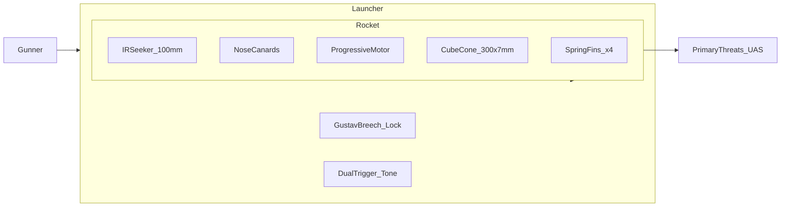
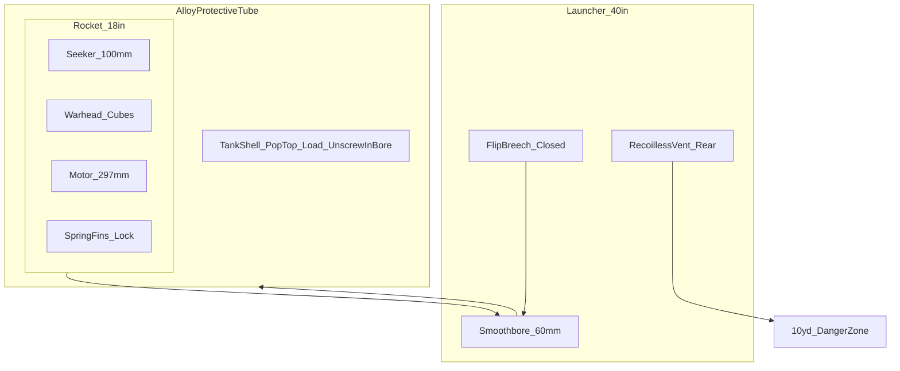
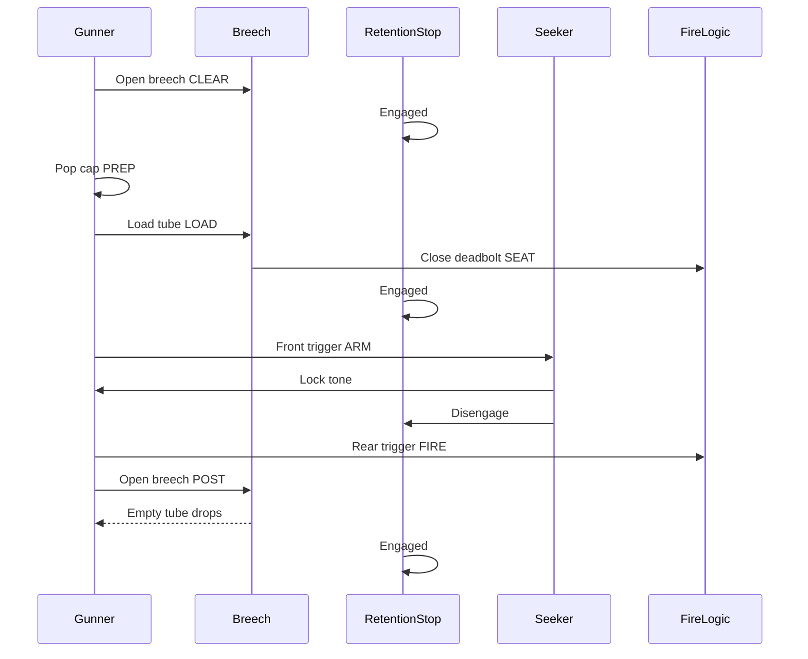
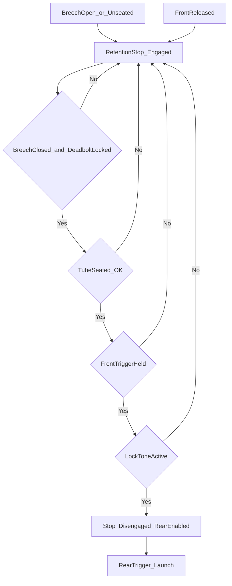

# 06 — System Description

**Document ID:** RADR / DOC-06  
**Version:** 1.7.0  
**Status:** Conceptual

Engineering detail (authoritative mechanics in annexes): [Annex F — Breech & retention](../annexes/F-employment-and-breech.md) · [G — Mass/CG](../annexes/G-mass-and-center-of-gravity.md) · [H — Motor](../annexes/H-motor-progressive-burn.md) · [I — Performance](../annexes/I-performance-modeling.md) · [J — Warhead](../annexes/J-warhead-dispersal.md) · Trajectory script: [`scripts/radr_trajectory.py`](../scripts/radr_trajectory.py)

**Prototype plan:** [DOC-10 — Phase 1 gates](10-phase-1-prototype-gates.md) (breech/retention → tube continuity → fire-control UX before live ballistics). **Motor vendor:** [DOC-09](09-motor-vendor-brief.md).

---

## System Overview

**RADR** comprises:

1. **Launcher** — 40 in reusable recoilless tube (≤ 5.5 kg empty), modernized M1 Bazooka ergonomics, Gustav flip breech, dual-trigger grips, **rocket retention stop**, no shoulder stock, slightly rear-biased CoG.  
2. **Rocket** — 60 mm × 18 in round (≤ 3.5 kg) in an **alloy protective tube**: IR seeker, **moderate-maneuver** canards, mildly progressive motor, **pyrotechnic-dispersed** dense alloy cube flak warhead.

---

## Diagrams

Mechanical and employment detail: [Annex F — Breech](../annexes/F-employment-and-breech.md#breech-mechanism) · [Retention stop](../annexes/F-employment-and-breech.md#rocket-retention-stop) · [Gunner sequence](../annexes/F-employment-and-breech.md#loading-and-firing--gunners-sequence)

### Physical Assembly (Conceptual)

At **LOCKED_SEATED**, the protective tube is fully inside the 60 mm smoothbore; the flip breech block is deadbolt-locked against the tube rim; the retention stop finger bears on the tube aft shoulder until the gunner arms the seeker and receives lock tone. Exhaust vents rearward through the recoilless path (10 yd danger zone).

- **Alloy protective tube** (**tank-shell**): stays in launcher; **rocket smaller than tube ID**; **pop-top** (PULL) then **load** then **unscrew breech cap in bore**; **foil contacts** → **rocket ready** when breech locks. Art unchanged: [`radr-container-authoritative.png`](../visuals/rocket/output/radr-container-authoritative.png). CAD: [`CONTAINER-SPEC.md`](../visuals/rocket/CONTAINER-SPEC.md).  
- **Rocket** (18 in, stowed fins): authoritative art [`radr-round-authoritative.png`](../visuals/rocket/output/radr-round-authoritative.png) · [`ROUND-SPEC.md`](../visuals/rocket/ROUND-SPEC.md).  
- **Rocket** rides inside the tube; tube rim mates **breech sealing face** and **rim contacts**.  
- On fire, motor exhaust vents **rear** through launcher — not a closed-bore cannon.

### Employment Sequence (States)

Time-ordered interaction between gunner, breech, retention stop, seeker, and fire logic. **Retention resets on breech open.** Full sequence: [Annex F — Gunner’s quick reference](../annexes/F-employment-and-breech.md#gunners-quick-reference-one-page) and [§ Gunner’s Sequence](../annexes/F-employment-and-breech.md#loading-and-firing--gunners-sequence).

### Safety Interlock Flow

Logical gates for carry-safe operation. All three conditions (closed locked breech, front held, lock tone) are required before the retention stop retracts and the rear trigger enables. Diagram matches [Annex F § Safety Interlock Flow](../annexes/F-employment-and-breech.md#safety-interlock-flow).

### Post-Fire Tube Ejection

After motor burnout and safe interval, the gunner clears the rear arc, unlocks the breech, and the spent protective tube drops for the next reload cycle.

---

## Primary Threats (Design Basis)

| Category | Representative behavior |
|----------|------------------------|
| FPV kamikaze | High closure, terminal dive |
| Small–medium quadcopters | Hover, orbit, light attack |
| Loitering munitions | Commit from standoff |
| GPS-denied / terrain-matching gliders | Low signature glide |
| Group 1–2 swarm / interdiction | Brief exposure, multiple tracks |

---

## Launcher

*Deployed (12→6):* [authoritative-deployed](../visuals/launcher/output/radr-bazooka-authoritative-deployed.png)

| Parameter | Spec |
|-----------|------|
| Length | 40 in (1016 mm) |
| Mass (empty) | ≤ 5.5 kg (nominal **4.95 kg** — [Annex G](../annexes/G-mass-and-center-of-gravity.md)) |
| Bore | 60 mm smoothbore (baseline) |
| Layout | Modernized **M1 Bazooka** — long slim tube; **no fixed shoulder stock** |
| Grips | Forward vertical foregrip (between muzzle and sight) with **pistol-style seeker trigger** and **+ / −** zoom; **rear pistol grip** just aft of sight module (fire trigger) |
| **Shoulder bar** | **6 in** thin rod; hinge on **forward black sleeve**; [stowed](../visuals/launcher/output/radr-bazooka-authoritative-stowed.png) / [deployed](../visuals/launcher/output/radr-bazooka-authoritative-deployed.png) |
| Padding | Rear section only (**aft of rear grip** → breech) |
| Sight | Integrated **digital camera-style** sight; **smooth 1×–20×** zoom |
| Display | Fold-out **~4 in** panel — wired to sight (not a look-down optic) |
| Zoom control | **+ / −** on **aft face** of foregrip — smooth zoom, same handle bus as display |
| Launcher power | Grip battery — sight, display, zoom, fire-control |
| Finish | Matte tactical camo (non-reflective) |
| Round | Tube: [CONTAINER-SPEC](../visuals/rocket/CONTAINER-SPEC.md) · [container art](../visuals/rocket/output/radr-container-authoritative.png). Rocket: [ROUND-SPEC](../visuals/rocket/ROUND-SPEC.md) · [round art](../visuals/rocket/output/radr-round-authoritative.png) |
| Seating | Pressure sensor + electrical contacts |
| Triggers | **Front:** same curved pistol trigger as rear, **slightly smaller** — seeker + **audible lock tone** · **Rear:** fire (front held) |
| **Retention stop** | Mechanical bore stop — see below |
| CoG | Slightly **rear-biased** (~248 mm rocket CG — Annex G) |
| Backblast | ≤ **10 yards (30 ft)** rear |
| Tracker | None |

### Forward device — muzzle brake / blast deflector

The fitting at the **muzzle** (M1 Bazooka–heritage silhouette) is a **combined muzzle brake and blast deflector**, not a decorative cap.

| Function | Description |
|----------|-------------|
| **Recoilless vent management** | A fraction of launch gas exits **rearward** through the breech vent path; the forward device captures and redirects **residual forward blast** away from the gunner’s support hand |
| **Impulse reduction** | Baffle surfaces reduce **peak overpressure** at the muzzle plane during firing |
| **Hand clearance** | Deflector geometry keeps the **forward foregrip** outside the primary blast cone |
| **Mass** | **~0.20 kg** (budgeted within main tube forward section — [Annex G](../annexes/G-mass-and-center-of-gravity.md)) |

Visual intent: [visuals/README.md](../visuals/README.md). Concept art (Goodmk62) — forward hardware to be read as this device in future renders.

### Fold-down shoulder bar

Optional **shoulder support** — not a fixed stock. The bar is one part of a **shared recoil path** (progressive motor, both grips, rear pad); it does **not** take the full impulse alone.

| State | Behavior |
|-------|----------|
| **Stowed** | **~12 mm** rod **flush** in sleeve channel — [authoritative stowed](../visuals/launcher/output/radr-bazooka-authoritative-stowed.png) |
| **Deployed** | **12→6** vertical — [authoritative deployed](../visuals/launcher/output/radr-bazooka-authoritative-deployed.png) |
| **Firing** | **Shoulder-fired** baseline — bar against shoulder or upper chest; **RPG-style** aim on fold-out display at arm’s length. **No cheek weld** required. **Not** hip-fire |

Cross-section stays **soft and rounded** (same diamond pad texture as the rear wrap) — no sharp corners or add-on end stopper.

### Rocket Retention Stop

A **spring-biased radial bore finger** in the lower bore wall bears on the protective tube **aft shoulder** and blocks **forward slide** toward the muzzle during sling carry. The breech sealing face holds the tube rearward; the finger is the anti-creep element. The stop **disengages** only when: breech **deadbolt-locked**, gunner holds **front trigger**, and seeker outputs **steady lock tone** — then a **release cam** retracts the finger **~2–4 mm** flush to the bore. Releasing the front trigger **re-engages** immediately. The **rear trigger never** drives the stop.

| State | Retention stop |
|-------|----------------|
| Breech open / not seated | **Engaged** |
| Breech closed, front trigger not held | **Engaged** |
| Breech closed, front held, no ready tone | **Engaged** |
| Breech closed, front held, **ready tone** | **Disengaged** |
| Front trigger released | **Re-engages** immediately |

Full mechanism and causality table: [Annex F § Rocket Retention Stop](../annexes/F-employment-and-breech.md#rocket-retention-stop).

### Breech (Summary)

**Gustav-style flip block** on a rear hinge (~90° open). Pull the **spring-return bolt handle** **15–25 mm** aft — **unlock cam** lifts the **deadbolt**; swing open on detent; insert tube; close; **release** handle so the return spring drives the deadbolt into the receiver notch with an audible **snap**. That snap is the positive lock (bolt-action feel). `SEATED` confirm via pressure + rim contacts gates seeker and retention logic.

Full mechanical detail (bolt kinematics, lock elements, user feel): [Annex F § Breech Mechanism](../annexes/F-employment-and-breech.md#breech-mechanism).

### Digital Sight, Fold-Out Display, and Controls (Locked)

| Element | Baseline |
|---------|----------|
| **Sight sensor** | **Digital camera-style** module on the tube — **not** a traditional holographic or look-down optic |
| **Magnification** | **Smooth continuous zoom 1×–20×** (software-driven; no stepped detents) |
| **Fold-out display** | **~4 in (102 mm)** panel on a side hinge; **stowed:** flush against tube — bottom edge aligned with sight housing |
| **Wiring** | Sight sensor, display, and foregrip **+ / −** share one integrated launcher AV bus (same handle cluster) |
| **Zoom** | **+** and **−** on the **aft face** of the forward foregrip; right-handed gunner: **left index** on front trigger, **left thumb** on zoom |
| **Battery** | Rechargeable cell in **pistol grip** powers sight, display, zoom, triggers, and tone |
| **Round seeker** | **100 mm IR F&F** on the rocket via rim contacts — **lock tone** = round seeker, not launcher video |

#### RPG-style shouldering (not precision rifle optics)

| Principle | RADR approach |
|-----------|----------------|
| **Sight picture** | Glance at **fold-out display** at **arm’s length** while shouldering — like **RPG / Bazooka** rough aim |
| **Cheek weld** | **Not required** — gunner may use rear pad for comfort but aiming does not depend on it |
| **Traditional optic** | **Rejected** — no squinting through a small glass channel at 1000 m |
| **Front / rear triggers** | **Front** = seeker power + **audible lock tone** (retention releases) · **Rear** = fire only with front held + tone |

#### Stowed vs. deployed

| State | Configuration |
|-------|----------------|
| **Carry / sling** | Display **folded flush** — panel coplanar with sight housing lower edge |
| **Engage** | Flip display out; dial **+ / −** to frame threat (**1×** wide search → **up to 20×** for small UAS at range) |
| **Fire** | Hold **front trigger** for tone while keeping threat on screen; **rear trigger** when tone steady |

#### Why digital 1×–20× + fold-out (KISS)

- **1×** supports quick acquisition and peripheral context at arm’s length.  
- **Smooth zoom to 20×** helps identify small Group 1–2 UAS out to the **1000 m** goal without a rail-mounted scope stack.  
- **Foregrip + / −** keeps zoom on the **support hand**; firing hand stays on rear grip.  
- **Not** rocket IR video on the launcher display pre-lock — **lock tone** still comes from the **round seeker** (disposable round, simple interface).

**KISS boundary:** One integrated sight + display subsystem; no seeker feed on launcher screen until a future variant.

---

## Rocket

| Parameter | Spec |
|-----------|------|
| Caliber / length | 60 mm × 18 in (457 mm) max |
| Mass | ≤ 3.5 kg (nominal **3.1 kg** — Annex G) |
| Seeker | 100 mm IR fire-and-forget |
| Canards | Small movable surfaces **near nose**; **moderate-maneuver** trim |
| Fins | 4 swept **spring-loaded** at **base**; deploy on exit; **mechanical lock** once deployed |
| Motor | Solid rocket; **Evolution Space** propellant; **mildly progressive** grain — [Annex H](../annexes/H-motor-progressive-burn.md) |
| Warhead | 300 × 7 mm **dense alloy** rough-edged cubes |
| Dispersal | **Pyrotechnic dispersal charge** — forward-biased cone **~10–12 ft** wide @ **~20 ft** |
| Fuze | **Radar or millimeter-wave proximity** (primary) + **timed backup** |

### Mass (Summary)

| Component | kg (nominal) |
|-----------|--------------|
| Seeker + avionics | 0.65 |
| Warhead | 1.05 |
| Motor + propellant | 1.20 |
| Structure, fins, canards | 0.20 |
| **Total** | **3.10** |

Component-level mass budget, axial distribution, and CG sensitivity: [Annex G](../annexes/G-mass-and-center-of-gravity.md).

---

## Motor (Summary — 1000 m Goal)

| Parameter | Locked baseline |
|-----------|-----------------|
| Total impulse | **2950–3050 N·s** (~3000 nominal) |
| Burn time | **~3.3 s** |
| Grain | **Mildly progressive** — lower thrust first **1–2 s**, then ramp |
| Initial thrust | **750–850 N** |
| Peak thrust | **1050–1150 N** |
| Est. velocity @ 1000 m | **330–350 m/s** |

| Time (s) | Thrust (N, notional) | Phase |
|----------|----------------------|--------|
| 0–2.0 | 780–820 avg | Low — recoil/backblast |
| 2.0–3.0 | 870 → 1120 ramp | Mildly progressive |
| 3.0–3.3 | ~1050 tail | Burnout |

Full table and rationale: [Annex H](../annexes/H-motor-progressive-burn.md). Performance model: [Annex I](../annexes/I-performance-modeling.md).

---

## Fuze and Kill Chain

**Primary (locked):** **Radar or millimeter-wave proximity** sensor at **~20 ft** standoff — engineering selects one baseline path (radar proximity or mm-wave proximity), not both on one round. Detects the target envelope and initiates the burster without requiring direct impact.

**Backup:** **Timed fuze** if the proximity channel fails — preserves forward-cone geometry.

**Why this choice:** Group 1–2 UAS present small radar/RF and physical cross-sections at **engagement range**; proximity at standoff matches the **forward kill cone** flak pattern and **KISS** fire-and-forget employment (no impact fuze, no command link).

1. Proximity (radar or mm-wave) initiates at **~20 ft** (primary).  
2. Timed backup if proximity does not fire.  
3. Burster opens cube pack into **forward cone** (~10–12 ft wide).  
4. Cubes strike rotors, battery, sensors, and airframe.

Detail: [Annex H — Motor](../annexes/H-motor-progressive-burn.md) · [Annex I — Performance](../annexes/I-performance-modeling.md) · [Annex J — Warhead](../annexes/J-warhead-dispersal.md) · [Annex F — Employment](../annexes/F-employment-and-breech.md)

---

## Operational Flow (Summary)

| Step | Action |
|------|--------|
| 1 | Open breech |
| 2 | Pop top → load tube → unscrew bottom in bore → close → rocket ready |
| 3 | Load tube |
| 4 | Close breech — deadbolt locks, **SEATED** |
| 5 | Hold front trigger → **lock tone** (retention stop **releases**) |
| 6 | Pull rear trigger (front held) → fire |
| 7 | Open breech → empty tube drops out |

**Authoritative detail** (interlocks, abort rules, timing): [Annex F](../annexes/F-employment-and-breech.md).

---

## Employment

**Team:** Gunner + ammo bearer. **Single carry:** ≤ 9.0 kg (nominal **8.05 kg** loaded — Annex G).

---

[← Key Design Trades](05-key-design-trades.md) | [Next: Limitations →](07-limitations-and-risks.md)
