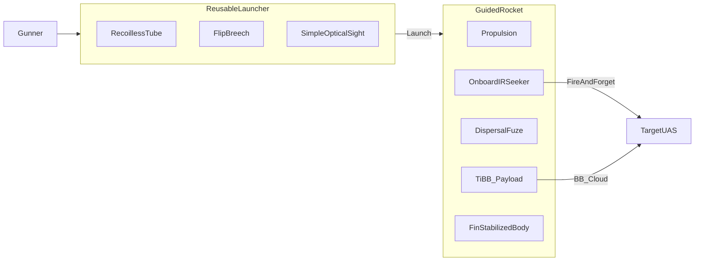

# 06 — System Description

**Document ID:** TKI-30-66 / DOC-06  
**Version:** 0.4.0  
**Status:** Conceptual

Stabilization: [Annex D — Projectile Stabilization](../annexes/D-projectile-stabilization.md)

---

## System Overview

TKI-30-66 (Splash) comprises:

1. **Launcher** — Reusable recoilless-style tube with flip breech (~7 kg empty)
2. **Guided rocket** — Lightweight round ≤ 457 mm, onboard IR seeker, Ti BB flak warhead

Two-man team: **gunner** + **ammo bearer**.

---

## Launcher

| Subsystem | Description |
|-----------|-------------|
| Barrel / tube | Smoothbore recoilless launch tube, ~50 mm bore |
| Breech | Flip-open rear; mechanical lock; spent case extraction |
| Sight | Simple optical or optional 1.5×; gunner acquires target for seeker lock |
| Trigger group | Safety, trigger, seeker lock indicator |
| Countermass | Hybrid backblast mitigation |

| Parameter | Notional |
|-----------|----------|
| Empty mass | ~7.0 kg |
| Length | ~800–900 mm |
| Service life | ≥ 500 rockets |

**No** integrated laser designator, **no** launcher-mounted tracker, **no** breech BIT module.

### Operation

1. Open breech; insert rocket
2. Close and lock breech
3. Gunner acquires UAS; achieve IR seeker lock (audio/visual ready)
4. Fire — rocket guides autonomously
5. Extract spent case; reload

---

## Guided Rocket

| Section (typical aft to front) | Component | Function |
|------------------------------|-----------|----------|
| Aft | Propulsion | Launch; countermass |
| Mid | Fin assembly | Stability and maneuver |
| Mid-forward | Autopilot | Fin deflection from seeker |
| Forward-mid | Dispersal fuze + Ti BB payload | Terminal cloud release |
| Forward | IR seeker dome | Fire-and-forget homing |

| Parameter | Notional |
|-----------|----------|
| OAL | ≤ 457 mm (18 in) |
| Mass | ~2.3 kg (goal) |
| Caliber | 50 mm body |

### Propulsion

Single-stage; hybrid backblast mitigation; ~650 m/s muzzle velocity (notional).

### Guidance — Onboard IR (Fire-and-Forget)

| Parameter | Notional |
|-----------|----------|
| Type | Simplified IR homing — baby Stinger / Igla class; drone-optimized |
| Lock | Seeker lock before fire; then autonomous |
| Post-launch | No human track required |
| Mass (seeker section) | ~200–350 g |
| Cost contribution | Dominates round cost |

**Honest limit:** Not full MANPADS imaging seeker performance at this size and price point.

### Warhead — Ti BB Flak

| Parameter | Notional |
|-----------|----------|
| Payload | Titanium ball bearings in dispersal carrier |
| Function | Eject BB cloud near target — flak defeat |
| Fuze | Proximity IR or timed (TBD) |
| Kill mechanism | Multiple strikes on rotors, motor, wing, battery |

Near-miss still effective if cloud intersects airframe volume — unlike kinetic rod.

---

## Employment

| Role | Responsibilities |
|------|----------------|
| Gunner | Acquire, lock, fire, reload |
| Ammo bearer | Spare rockets, security |

### Engagement Sequence

1. Detect and ID (ROE)
2. Gunner acquires in sight; seeker achieves lock
3. Fire
4. Rocket homing; fuze disperses BB cloud at terminal
5. BDA; reload if needed

---

## Related Documents

| Document | Purpose |
|----------|---------|
| [05 — Key Design Trades](05-key-design-trades.md) | Rationale |
| [07 — Limitations and Risks](07-limitations-and-risks.md) | Limits |

---

[← Key Design Trades](05-key-design-trades.md) | [Next: Limitations and Risks →](07-limitations-and-risks.md)
