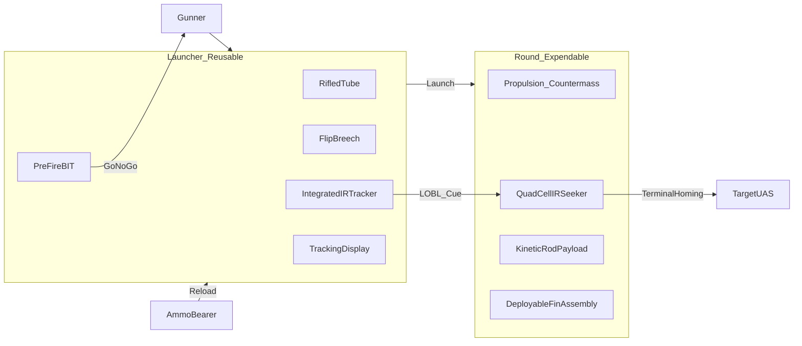

# 06 — System Description

**Document ID:** TKI-30-66 / DOC-06  
**Version:** 0.3.0  
**Status:** Conceptual

Stabilization detail: [Annex D — Projectile Stabilization](../annexes/D-projectile-stabilization.md)

---

## System Overview

TKI-30-66 (Splash) consists of two primary components:

1. **Launcher** — Reusable, shoulder-fired weapon with flip breech and **integrated IR tracking sight**
2. **Round** — Guided kinetic projectile (~305 mm OAL, ~2.5 kg) with **rugged quad-cell IR seeker**

No external laser designator is required. Guidance follows a **Javelin-like architecture** hardened for reliability: tracker and BIT in the launcher; minimal seeker on the round.

A two-man team operates the system: **gunner** (launcher) and **ammo bearer** (spare rounds, local security).

---

## Launcher

### Description

The launcher is a reusable, shoulder-fired weapon patterned after recoilless rifle operation (Carl Gustaf class) but scaled to 50 mm caliber. Unlike Gustaf, it integrates a **compact IR tracking sight** — the reusable guidance asset.

| Subsystem | Description |
|-----------|-------------|
| Barrel | Rifled steel tube, ~350–450 mm length, 6-groove button rifling |
| Breech | Flip-open rear breech for round insertion; mechanical lock |
| **IR tracking module** | **Field-replaceable LRU; wide-FOV IR sensor + display; LOBL cue to round** |
| **Pre-fire BIT** | **Tests round seeker + fin release circuit at breech contact; blocks fire on fail** |
| Trigger group | Grip safety, trigger, go/no-go lock indicator (green/red) |
| Breech interlock | Mechanical — trigger disabled unless breech fully locked |
| Shoulder rest | Adjustable; absorbs residual recoil |
| Countermass port | Rear vent for backblast mitigation (hybrid design) |
| Electrical interface | Brief contact with round at breech for seeker boresight / LOBL transfer |

### Mass and Dimensions (Notional)

| Parameter | Value |
|-----------|-------|
| Empty mass | ~8.0 kg (includes IR tracker) |
| Overall length | ~800–900 mm |
| Service life | ≥ 500 rounds (threshold); ≥ 1000 (objective) |

The ~1 kg mass increase over an unguided tube buys a reusable tracker that amortizes across hundreds of shots.

### Operation

1. Flip breech open
2. Insert sealed round (electrical contact mates)
3. Close and lock breech — **BIT runs automatically** (~1–2 s)
4. **Go/no-go:** If BIT fail → extract round, discard, load next; do not fire
5. Gunner acquires UAS in IR tracker; system confirms LOBL
6. Fire — round homing autonomous after launch
7. Open breech, extract spent case, reload

Reload time target: ≤ 10 s (trained gunner). BIT adds ≤ 2 s to engagement sequence — accepted reliability cost.

---

## Round

### Description

The ready round is a sealed cartridge approximately 305 mm (12 in) long and 50 mm in diameter, mass ~2.5 kg.

| Section (aft to front) | Component | Function |
|------------------------|-----------|----------|
| Aft | Propulsion cartridge | Launch impulse; countermass ejection |
| Mid | Fin assembly (stowed) | Deploys post-muzzle for aerodynamic stability |
| Mid-forward | Flight control / autopilot | Fin deflection for terminal homing corrections |
| Forward | **Quad-cell IR seeker** | **Terminal homing — four-element detector, no imaging FPA** |
| Forward | Kinetic rod (sabot-mounted) | Terminal defeat mechanism |

### Propulsion

Single-stage propellant with hybrid backblast mitigation. Notional muzzle velocity: **~650 m/s** (moderate — prioritizes component survival over max range). Spent case remains in breech for extraction (Gustaf-like).

### Seeker — Quad-Cell IR (Baseline)

| Parameter | Notional Value |
|-----------|----------------|
| Type | **Quad-cell IR homing head** — four detector elements; no imaging FPA; no moving parts |
| Aperture | ~25–30 mm |
| Lock mode | LOBL cued by launcher; verified by pre-fire BIT |
| Post-launch | Autonomous terminal homing |
| Mass | ~150–200 g |
| Unit cost (volume) | ~$100–180 (reliability spec) |

**Rejected for baseline (reliability):** micro-bolometer FPAs, rosette-scan mechanisms, FMCW radar.

### Reliability Features (Round)

| Feature | Purpose |
|---------|---------|
| Factory 100% BIT | Every round tested before packaging |
| Shock-isolated seeker mount | Launch setback survival |
| Protected seeker window | Sealed until muzzle exit |
| Dual springs per fin | Redundant fin deployment |
| Sealed consumable | No unit repair — discard on BIT fail |

### Payload — Unitary Kinetic Rod (Baseline)

| Parameter | Notional Value |
|-----------|----------------|
| Rod material | Tungsten or hardened steel (training: steel) |
| Rod length | ~150–200 mm |
| Rod diameter | ~15–20 mm |
| Kill mechanism | Structural defeat via kinetic energy transfer |

---

## Stabilization

TKI-30-66 uses a dual stabilization approach:

1. **Rifled barrel** imparts initial roll rate (~800–1200 RPM at muzzle)
2. **Deployable fins** spring outward and mechanically lock at ~15–30 m downrange

Guidance corrections begin after fin lock. See [Annex D — Projectile Stabilization](../annexes/D-projectile-stabilization.md).

---

## Employment

### Team Roles

| Role | Equipment | Responsibilities |
|------|-----------|------------------|
| Gunner | Launcher, 1 loaded round | Acquire/track in IR sight, confirm lock, fire, reload |
| Ammo Bearer | 2–3 spare rounds | Provide reloads, local security |

No separate designator operator. The gunner owns the engagement timeline.

### Engagement Sequence

1. **Cueing:** Visual, acoustic, or external sensor detection
2. **Identification:** ROE confirmation (hostile UAS)
3. **Acquisition:** Gunner acquires UAS in launcher IR tracker
4. **Lock:** System confirms LOBL on round seeker; indicator ready
5. **Fire:** Gunner fires; round exits, fins deploy, seeker homes
6. **Terminal:** Rod impacts target structure
7. **BDA:** Visual confirmation; reload if follow-on required

### Fire Control

Simple lock indicator — no ballistic computer required for baseline. Gunner must maintain track through LOBL confirmation; after fire, homing is autonomous on the round.

---

## Kill Mechanism

TKI-30-66 achieves defeat through **kinetic energy transfer**, not blast or fragmentation:

- Rod impact velocity at 600 m range: ~400–550 m/s (notional, drag-dependent)
- Impact energy concentrated on small contact area
- Target effects: rotor separation, motor destruction, structural failure, battery compromise
- No proximity fuze; direct hit required (honest assessment: miss = no effect)

---

## Related Documents

| Document | Purpose |
|----------|---------|
| [04 — CONOPS / Use Cases](04-conops-use-cases.md) | Operational scenarios |
| [05 — Key Design Trades](05-key-design-trades.md) | Guidance architecture rationale |
| [Annex D — Projectile Stabilization](../annexes/D-projectile-stabilization.md) | Fin/rifling engineering |
| [Annex A — Baseline Comparison](../annexes/A-baseline-comparison.md) | System comparisons |

---

[← Key Design Trades](05-key-design-trades.md) | [Next: Limitations and Risks →](07-limitations-and-risks.md)
