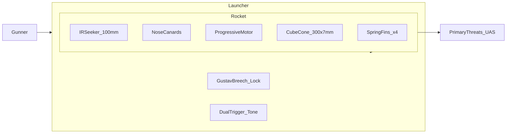
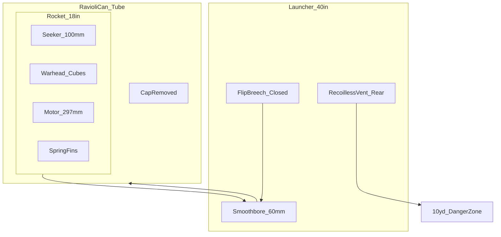
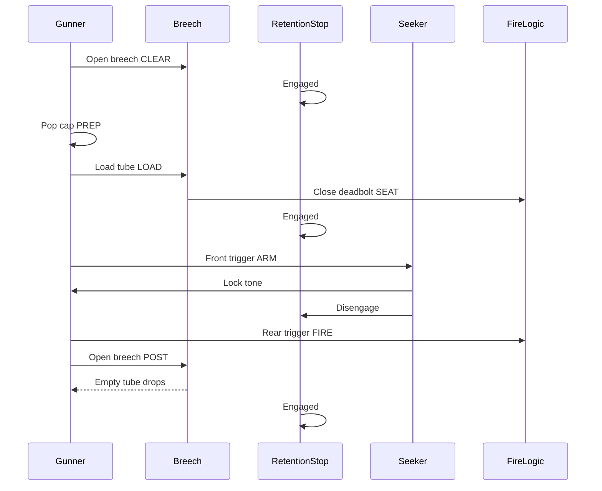
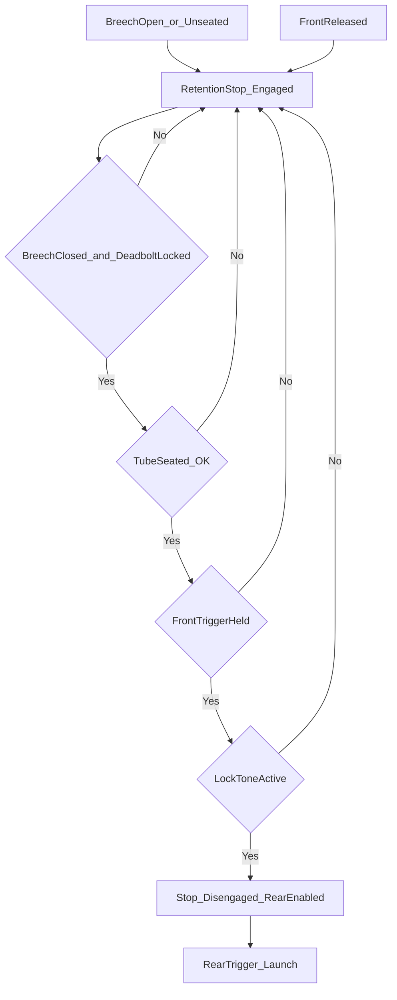
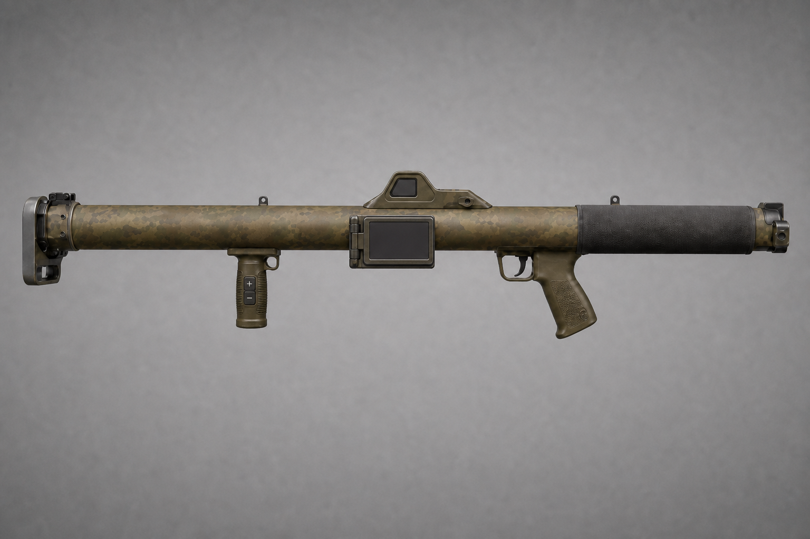

# 06 — System Description

**Document ID:** RADR / DOC-06  
**Version:** 1.2.0  
**Status:** Conceptual

Engineering detail: [Annex F](../annexes/F-employment-and-breech.md) · [Annex G](../annexes/G-mass-and-center-of-gravity.md) · [Annex H](../annexes/H-motor-progressive-burn.md)

---

## System Overview

**RADR** comprises:

1. **Launcher** — 40 in reusable recoilless tube (≤ 5.5 kg empty), modernized M1 Bazooka ergonomics, Gustav flip breech, dual-trigger grips, **rocket retention stop**, no shoulder stock.  
2. **Rocket** — 60 mm × 18 in round (≤ 3.5 kg) in ravioli-can protective tube: IR seeker, progressive motor, dense alloy cube flak warhead.

---

## Diagrams

Mechanical and employment detail: [Annex F — Breech](../annexes/F-employment-and-breech.md#breech-mechanism) · [Retention stop](../annexes/F-employment-and-breech.md#rocket-retention-stop) · [Gunner sequence](../annexes/F-employment-and-breech.md#loading-and-firing--gunners-sequence)

### Physical Assembly (Conceptual)

At **LOCKED_SEATED**, the protective tube is fully inside the 60 mm smoothbore; the flip breech block is deadbolt-locked against the tube rim; the retention stop finger bears on the tube aft shoulder until the gunner arms the seeker and receives lock tone. Exhaust vents rearward through the recoilless path (10 yd danger zone).

- **Ravioli-can** is the factory shipping and launch container.  
- **Rocket** rides inside the tube; tube rim mates **breech sealing face** and **rim contacts**.  
- On fire, motor exhaust vents **rear** through launcher — not a closed-bore cannon.

### Employment Sequence (States)

Time-ordered interaction between gunner, breech, retention stop, seeker, and fire logic. The retention stop stays engaged until lock tone; the rear trigger is inert until then. Full step-by-step narrative: [Annex F § Gunner’s Sequence](../annexes/F-employment-and-breech.md#loading-and-firing--gunners-sequence).

### Safety Interlock Flow

Logical gates for carry-safe operation. All three conditions (closed locked breech, front held, lock tone) are required before the retention stop retracts and the rear trigger enables. Diagram matches [Annex F § Safety Interlock Flow](../annexes/F-employment-and-breech.md#safety-interlock-flow).

### Post-Fire Tube Ejection

After motor burnout and safe interval, the gunner clears the rear arc, unlocks the breech, and the spent ravioli-can tube drops for the next reload cycle.

---

## Primary Threats (Design Basis)

| Category | Representative behavior |
|----------|------------------------|
| FPV kamikaze | High closure, terminal dive |
| Small–medium quadcopters | Hover, orbit, light attack |
| Loitering munitions | Commit from standoff |
| GPS-denied / terrain-matching gliders | Low signature glide |
| Group 1–2 swarm / interdiction | Brief exposure, multiple tracks |

---

## Launcher

| Parameter | Spec |
|-----------|------|
| Length | 40 in (1016 mm) |
| Mass (empty) | ≤ 5.5 kg (nominal **4.95 kg** — [Annex G](../annexes/G-mass-and-center-of-gravity.md)) |
| Bore | 60 mm smoothbore (baseline) |
| Layout | Modernized **M1 Bazooka** — long slim tube; **no shoulder stock** |
| Grips | Forward vertical foregrip (between muzzle and sight); rear pistol grip |
| Padding | Rear section only (pistol grip → breech) |
| Sight | Integrated holo **1.5×–4×** + fold-out **~4 in** viewer |
| Zoom control | **+ / −** on foregrip side |
| Launcher power | Grip battery — holo, display, fire-control |
| Finish | Matte tactical camo (non-reflective) |
| Round | Ravioli-can tube; soldier removes **manual pull-off cap** before load |
| Seating | Pressure sensor + electrical contacts |
| Triggers | **Front:** seeker + **audible lock tone** · **Rear:** fire (front held) |
| **Retention stop** | Mechanical bore stop — see below |
| CoG | Slightly **rear-biased** (~248 mm rocket CG — Annex G) |
| Backblast | ≤ **10 yards (30 ft)** rear |
| Tracker | None |

### Rocket Retention Stop

A **spring-biased radial bore finger** bears on the protective tube aft shoulder and blocks forward slide during sling carry and movement. The stop **disengages** only when the breech is deadbolt-locked, the gunner holds the **front trigger**, and the seeker outputs **steady lock tone**. Releasing the front trigger **re-engages** the stop immediately. The **rear trigger never** retracts the stop.

| State | Retention stop |
|-------|----------------|
| Breech open / not seated | **Engaged** |
| Breech closed, front trigger not held | **Engaged** |
| Breech closed, front held, no ready tone | **Engaged** |
| Breech closed, front held, **ready tone** | **Disengaged** |
| Front trigger released | **Re-engages** immediately |

Full mechanism and causality table: [Annex F § Rocket Retention Stop](../annexes/F-employment-and-breech.md#rocket-retention-stop).

### Breech (Summary)

**Gustav-style flip block** on a rear hinge (~90° open). Pull the **spring-return bolt handle** to clear a **deadbolt**; swing open; insert tube; close; **release** handle for **deadbolt snap** and `SEATED` confirm. Positive mechanical lock — bolt-action feel — before seeker or retention release.

Full operating principle, components, and state machine: [Annex F § Breech Mechanism](../annexes/F-employment-and-breech.md#breech-mechanism).

### Integrated Sight, Fold-Out Viewer, and Controls

| Element | Baseline |
|---------|----------|
| **Optics module** | Low-profile **variable holo/optics pod** (**1.5×–4×**) **integrated** on the tube — not a rail-mounted aftermarket sight |
| **Fold-out viewer** | **Camcorder-style** hinged flat panel, **~4 in (102 mm) wide**, roughly **barrel height** when deployed; **folds flush** against the tube for carry |
| **Display** | Panel shows the **same picture the holo/optics module sees** (reticle overlay, mag level) — gunner **looks at the screen** to aim instead of a narrow eyebox |
| **Zoom** | **+** and **−** buttons on the **side of the forward foregrip** — steps through **1.5× → 4×** (default **1.5×** on power-up) |
| **Battery** | Rechargeable cell in the **pistol grip** powers holo, display, zoom logic, triggers, and tone |
| **Round seeker** | **100 mm IR F&F** on the rocket; powered via **rim contacts** when seated — terminal lock, not the launcher camera |

#### Stowed vs. deployed

| State | Configuration |
|-------|----------------|
| **Carry / sling** | Viewer **folded flat** against tube; holo pod protected; retention stop **engaged** |
| **Engage** | Flip viewer out (one hand); verify picture + reticle; adjust mag with **+ / −** on foregrip |
| **Fire** | Hold front trigger for seeker tone while keeping threat in view on panel; rear trigger when tone steady |

#### Why fold-out + foregrip zoom (not 40×, not rail scope)

- **4 in panel** gives a **stable view** at arm’s length — easier than squinting through a tiny optic at 1000 m.  
- **1.5×–4×** stays inside **rough-aim + seeker FOV** discipline (~2–4° notional seeker cone).  
- **Foregrip + / −** keeps zoom control on the **support hand** without breaking grip on the firing hand.  
- **Not** the rocket IR feed on the screen pre-lock — launcher optics only. **Lock tone** = round seeker; avoids wiring/video from disposable round.

#### Human eye vs. mag (unchanged rationale)

At **1000 m**, a **~0.4 m** drone is ~**1.4 arcmin** at 1× — edge of vision. **4×** on the panel ≈ **5.5 arcmin** — enough to **center the reticle** before seeker search. Rotor detail still comes from **IR seeker**, not the holo.

**KISS boundary:** No 40× optical stack; no seeker video on launcher display until a future variant. Panel + holo + grip battery stay one integrated launcher subsystem.

---

## Rocket

| Parameter | Spec |
|-----------|------|
| Caliber / length | 60 mm × 18 in (457 mm) max |
| Mass | ≤ 3.5 kg (nominal **3.1 kg** — Annex G) |
| Seeker | 100 mm IR fire-and-forget |
| Canards | Small movable surfaces **near nose** |
| Fins | 4 swept **spring-loaded** at **base**; deploy on exit |
| Motor | Solid rocket; **Evolution Space** propellant; progressive grain — [Annex H](../annexes/H-motor-progressive-burn.md) |
| Warhead | 300 × 7 mm **dense alloy** rough-edged cubes |
| Dispersal | Forward cone ~10–12 ft wide @ ~20 ft |
| Fuze | **Radar or millimeter-wave proximity** (primary) + **timed backup** |

### Mass (Summary)

| Component | kg (nominal) |
|-----------|--------------|
| Seeker + avionics | 0.65 |
| Warhead | 1.05 |
| Motor + propellant | 1.20 |
| Structure, fins, canards | 0.20 |
| **Total** | **3.10** |

Detail and CG: [Annex G](../annexes/G-mass-and-center-of-gravity.md).

---

## Motor (Summary — 1000 m Goal)

| Time (s) | Thrust (N, notional) | Phase |
|----------|----------------------|--------|
| 0–2.0 | ~700 avg | Low — recoil/backblast |
| 2.0–3.2 | 750 → 1050 ramp | Progressive |
| 3.2–3.4 | ~950 tail | Burnout |

**Total impulse:** ~2900 N·s (band 2800–3200 N·s). Full table: [Annex H](../annexes/H-motor-progressive-burn.md).

---

## Fuze and Kill Chain

**Primary (locked):** **Radar or millimeter-wave proximity** sensor at **~20 ft** standoff — engineering selects one baseline path (radar proximity or mm-wave proximity), not both on one round. Detects the target envelope and initiates the burster without requiring direct impact.

**Backup:** **Timed fuze** if the proximity channel fails — preserves forward-cone geometry.

**Why this choice:** Group 1–2 UAS present small radar/RF and physical cross-sections at terminal range; proximity at standoff matches the **forward cone** flak pattern and **KISS** fire-and-forget employment (no impact fuze, no command link).

1. Proximity (radar or mm-wave) initiates at **~20 ft** (primary).  
2. Timed backup if proximity does not fire.  
3. Burster opens cube pack into **forward cone** (~10–12 ft wide).  
4. Cubes strike rotors, battery, sensors, and airframe.

Detail: [Annex H — Motor](../annexes/H-motor-progressive-burn.md) · [Annex F — Employment](../annexes/F-employment-and-breech.md)

---

## Operational Flow (Summary)

| Step | Action |
|------|--------|
| 1 | Open breech |
| 2 | Pop cap off tube |
| 3 | Load tube |
| 4 | Close breech — deadbolt locks, **SEATED** |
| 5 | Hold front trigger → **lock tone** (retention stop **releases**) |
| 6 | Pull rear trigger (front held) → fire |
| 7 | Open breech → empty tube drops out |

**Authoritative detail** (interlocks, abort rules, timing): [Annex F](../annexes/F-employment-and-breech.md).

---

## Employment

**Team:** Gunner + ammo bearer. **Single carry:** ≤ 9.0 kg (nominal **8.05 kg** loaded — Annex G).

---

[← Key Design Trades](05-key-design-trades.md) | [Next: Limitations →](07-limitations-and-risks.md)
