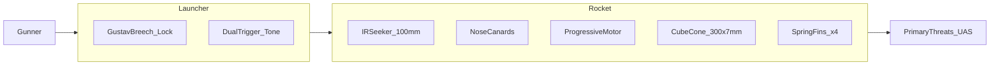

# 06 — System Description

**Document ID:** RADR / DOC-06  
**Version:** 0.8.0  
**Status:** Conceptual

---

## System Overview

**RADR** comprises:

1. **Launcher** — 36 in reusable recoilless tube (≤ 5.5 kg empty), Gustav flip breech with spring bolt and positive lock, dual-trigger grips.  
2. **Rocket** — 60 mm × 18 in round (≤ 3.5 kg) in ravioli-can protective tube: IR seeker, progressive motor, dense alloy cube flak warhead.

---

## Primary Threats (Design Basis)

| Category | Representative behavior |
|----------|------------------------|
| FPV kamikaze | High closure, terminal dive |
| Small–medium quadcopters | Hover, orbit, light attack |
| Loitering munitions | Commit from standoff |
| GPS-denied / terrain-matching gliders | Low signature glide |
| Group 1–2 swarm / interdiction | Brief exposure, multiple tracks |

---

## Launcher

| Parameter | Spec |
|-----------|------|
| Length | 36 in (914 mm) |
| Mass (empty) | ≤ 5.5 kg |
| Bore | 60 mm smoothbore (baseline) |
| Breech | Gustav-style flip; spring-loaded bolt; **positive lock** (bolt-action feel) |
| Round | Ravioli-can tube; soldier removes **pull-off cap** before load |
| Seating | Pressure sensor + electrical contacts |
| Triggers | **Front:** seeker + **audible lock tone** · **Rear:** fire (front held) |
| CoG | Slightly **rear-biased** for shouldering |
| Backblast | ≤ **10 yards (30 ft)** rear |
| Tracker | None |

---

## Rocket

| Parameter | Spec |
|-----------|------|
| Caliber / length | 60 mm × 18 in (457 mm) max |
| Mass | ≤ 3.5 kg |
| Seeker | 100 mm IR fire-and-forget |
| Canards | Small movable surfaces **near nose** |
| Fins | 4 swept **spring-loaded** at **base**; deploy on exit |
| Motor | Progressive: **lower thrust 1–2 s**, then ramp |
| Warhead | 300 × 7 mm **dense alloy** rough-edged cubes |
| Dispersal | Forward cone ~10–12 ft wide @ ~20 ft |
| Fuze | **Proximity primary** + **timed backup** |

### Mass Breakdown (Notional)

| Component | kg |
|-----------|-----|
| Warhead | 0.95–1.15 |
| Seeker + avionics | 0.45–0.55 |
| Motor + propellant | 1.10–1.30 |
| Structure, fins, canards | 0.35–0.45 |
| **Total** | ≤ **3.5** |

---

## Motor (Notional — 1000 m Goal)

| Phase | Behavior |
|-------|----------|
| 0–2 s | **Reduced thrust** — recoil and backblast control |
| Ramp | Increasing thrust for range closure |
| Goal | **1000 m** effective engagement (notional) |

---

## Fuze & Kill Chain

1. Proximity initiates at **~20 ft** (primary).  
2. Timed backup if proximity fails.  
3. Burster opens cube pack into **forward cone**.  
4. Cubes strike rotors, battery, sensors, and airframe.

---

## Operational Flow

| Step | Action |
|------|--------|
| 1 | Open breech |
| 2 | Pop cap off tube |
| 3 | Load tube |
| 4 | Close breech (locks) |
| 5 | Hold front trigger → lock tone |
| 6 | Pull rear trigger (front held) → fire |
| 7 | Open breech → empty tube drops out |

---

## Employment

**Team:** Gunner + ammo bearer. **Single carry:** ≤ 9.0 kg.

---

[← Key Design Trades](05-key-design-trades.md) | [Next: Limitations →](07-limitations-and-risks.md)
