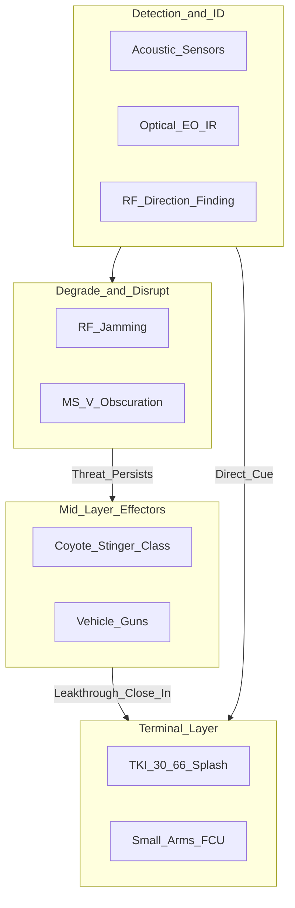

# 08 — Layered Defense Integration

**Document ID:** TKI-30-66 / DOC-08  
**Version:** 0.2.0  
**Status:** Conceptual

---

## Purpose

How TKI-30-66 (Splash) fits within layered counter-UAS architecture as a **terminal kinetic layer**.

---

## Layered Defense Model

---

## Layer Definitions

| Layer | Echelon | TKI-30-66 Relationship |
|-------|---------|------------------------|
| Detect / Identify | Squad to Brigade | TKI receives cues; launcher tracker does not search autonomously |
| Degrade / Disrupt | Company to Brigade | EW first; TKI for RF-immune threats |
| Mid-layer effectors | Battalion+ | TKI for leakthrough and cost-exchange cases |
| Terminal kinetic | Squad / SOF | **TKI primary layer** |

---

## Integration Points

### Detection → TKI Cueing

External sensors reduce detect-to-lock timeline. Gunner still must achieve IR LOBL in launcher sight.

| Sensor Type | Integration Method | Benefit |
|-------------|-------------------|---------|
| Acoustic | Audio alert → sector focus | Faster IR search |
| EO/IR tower | Radio cue with bearing | Pre-position gunner |
| RF DF | Bearing cue | Situational awareness |

### EW Layer Coordination

| Scenario | EW Action | TKI Action |
|----------|-----------|------------|
| RF-controlled UAS | Jamming may defeat | Standby; engage leakers |
| Autonomous / fiber UAS | EW ineffective | TKI primary |
| Mixed swarm | EW defeats RF subset | TKI on RF-immune threats |

**Note:** TKI baseline round uses passive IR homing — not jammed by RF EW. Launcher tracker is passive IR. Phase 2 radar round is RF-vulnerable.

### Obscuration (MS-V and Similar)

| Layer | Effect |
|-------|--------|
| TKI IR baseline | **Degraded** — smoke/obscurants reduce thermal contrast and line-of-sight |
| TKI radar variant (Phase 2) | Less affected; trade active RF signature |

**Integration note:** Friendly obscuration may block TKI IR engagements. Deconflict sectors or use radar round variant.

### Mid-Layer Handoff

TKI preferred when mid-layer cost-exchange is unfavorable (cheap UAS vs. expensive missile) or mid-layer unavailable.

---

## Escalation Doctrine (Notional)

1. Detect and identify
2. Attempt EW if RF-controlled
3. Mid-layer if available and range permits
4. TKI-30-66 for close-in leakthrough
5. Small arms as last resort

---

## Blue-Force Deconfliction

| Issue | SOP Requirement |
|-------|-----------------|
| Friendly UAS | Positive ID before LOBL |
| Friendly obscurants | Sector coordination |
| Adjacent TKI teams | Sector assignment; backblast awareness |
| Higher-echelon SHORAD | Airspace coordination |

No laser deconfliction required (system does not use laser guidance).

---

## Cost-Exchange Consideration

| Effector | Cost per Engagement | vs. $500 UAS |
|----------|--------------------|--------------|
| Coyote / Stinger | $120k–150k | Prohibitive |
| TKI-30-66 (IR round) | ~$300–450 | Marginal to favorable |
| Small arms (100 rds) | ~$100 | Favorable but low Pk |

---

## Related Documents

| Document | Purpose |
|----------|---------|
| [07 — Limitations and Risks](07-limitations-and-risks.md) | Obscuration and CCM |
| [Annex A — Baseline Comparison](../annexes/A-baseline-comparison.md) | System comparison |

---

[← Limitations and Risks](07-limitations-and-risks.md) | [Return to README →](../README.md)
