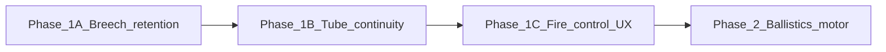

# 10 — Phase 1 Prototype Gates

**Document ID:** RADR / DOC-10  
**Version:** 1.0.0  
**Status:** Conceptual — mechanical-first prototype plan

**Authority for employment detail:** [Annex F — Employment & breech](../annexes/F-employment-and-breech.md)

Phase 1 proves **launcher mechanics and round packaging interfaces** before committing to live motor, seeker, or warhead test. Phase 2 (ballistics, static fire, lethality) is explicitly **out of scope** here.

---

## Phase 1A — Breech + retention stop

**Proves:** Gustav-style flip breech, deadbolt positive lock, rocket retention stop blocks forward motion until interlocks satisfied.

**Does not prove:** Live motor, seeker track, warhead function, ballistic accuracy.

| Item | Detail |
|------|--------|
| **Entry** | Bench launcher fixture; retention stop hardware; mock tube shoulder |
| **Procedure** | Cycle breech open/close 50×; attempt forward slide with stop engaged; verify stop releases only when interlock inputs simulated (breech closed + front held + tone) |
| **Pass** | Deadbolt snap repeatable; stop holds mock tube against **≥ 50 N** forward shove when interlocks false; stop releases when all three interlocks true |
| **Fail** | Creep open under shock; stop releases without tone; deadbolt does not seat |
| **Artifacts** | Video, force log (if available), photos of lock engagement |
| **Annex** | [F § Breech](../annexes/F-employment-and-breech.md#breech-mechanism) · [F § Retention stop](../annexes/F-employment-and-breech.md#rocket-retention-stop) |

---

## Phase 1B — Tube load + electrical continuity

**Proves:** Tank-shell load sequence — pop top → seat tube → unscrew bottom in bore → close breech → **rocket ready** (continuity).

**Does not prove:** Ballistic accuracy, fuze, motor impulse.

| Item | Detail |
|------|--------|
| **Entry** | 1A passed; alloy tube mock with foil contacts; inert round mock optional |
| **Procedure** | Trained operator completes load under **10 s** target; measure continuity resistance/LED; repeat 20 cycles |
| **Pass** | Continuity detected within **200 ms** of breech lock; no bind on tube insert; bottom cap removable in bore with gloved hands |
| **Fail** | Intermittent continuity; tube bind; cap cross-thread |
| **Artifacts** | Load-time log, continuity trace, CONTAINER-SPEC checklist signed |
| **Annex** | [CONTAINER-SPEC](../visuals/rocket/CONTAINER-SPEC.md) · [F gunner sequence](../annexes/F-employment-and-breech.md#loading-and-firing--gunners-sequence) |

---

## Phase 1C — Fire-control UX (bench)

**Proves:** Front trigger → seeker power + **steady lock tone** simulation; rear fire blocked until tone; rear requires front held; abort on front release.

**Does not prove:** Field lethality, real IR lock on drones.

| Item | Detail |
|------|--------|
| **Entry** | 1A + 1B passed; fire-control breadboard or launcher wiring harness |
| **Procedure** | Matrix test all trigger combinations; verify retention interlock follows tone sim |
| **Pass** | Rear inert fire output only when front held **and** tone active; releasing front aborts within **100 ms**; no rear-only path |
| **Fail** | Rear fires without tone; retention releases early |
| **Artifacts** | Interlock truth table signed, wiring diagram as-built |
| **Annex** | [F § Controls](../annexes/F-employment-and-breech.md#controls-and-triggers) · [DOC-06 interlock diagram](06-system-description.md#safety-interlock-flow) |

---

## Phase 2 — Forward dependencies (not Phase 1)

| Gate | Proves | Depends on |
|------|--------|------------|
| Motor static fire | Impulse, \(F(t)\), backblast vs 10 yd | [DOC-09 motor vendor brief](09-motor-vendor-brief.md) |
| Ballistic validation | v @ 1000 m, TOF | Motor + instrumented launch |
| Seeker / guidance | Track vs crossing targets | Hardware-in-loop |
| Warhead | Cone at ~20 ft, cube dispersion | Fuze + static arena |

Traceability matrix: [Annex I — Validated vs notional](../annexes/I-performance-modeling.md#validated-vs-notional-traceability).

---

## Program exit (Phase 1 complete)

Phase 1 is **complete** when **1A, 1B, and 1C** pass on the same launcher generation with documented artifacts. Only then authorize Phase 2 funding for motor/grain static test.

---

[← Motor vendor brief](09-motor-vendor-brief.md) · [Annex F](../annexes/F-employment-and-breech.md) · [System description](06-system-description.md)
