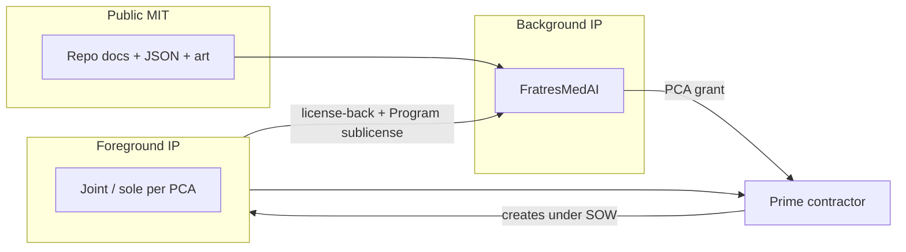

# Licensing & Prime Partnership

**RADR · Phase 0 · v1.7**  
**Audience:** Business development, contracts, and engineering leadership at U.S. defense primes and integrators.

---

## Why this repo is structured for prime collaboration

RADR is published as an **open concept** so the community can review the trade space,
while **production rights, patents, trademarks, and Program-specific exclusivity**
are handled through a **Prime Collaboration Agreement (PCA)**.

That split is intentional:

| Goal | Mechanism |
|------|-----------|
| Transparency & capture support | Public **MIT** license on docs and data |
| Prime can evaluate without fear of “toxic” terms | Clear **evaluation** tier; NDA optional |
| You keep control of the concept | **Background IP** stays with FratresMedAI unless assigned |
| Prime can invest in prototype & production | Negotiated **development** and **production** licenses |
| Government deliverables stay clean | **Foreground IP** and FAR/DFARS flow-down in PCA |

Full legal template: [LICENSE-COMMERCIAL.md](../LICENSE-COMMERCIAL.md).

---

## What you get at each tier

### Evaluation (no fee; standard NDA optional)

- Internal use of README, annexes, JSON baseline, and concept art for **capture, trade study, and architecture reviews**
- No right to represent RADR as your product without written approval
- No production, export, or fielding authorization

**Start here:** clone the repo or download a release tag; open a [partnership inquiry](https://github.com/FratresMedAI/RADR-mk.60/issues/new?template=partnership_inquiry.yml).

### Development (PCA required)

Typical scope:

- Prototype launcher/round interfaces, seeker integration, motor/warhead test articles
- Joint test plans and configuration control against `data/baseline_systems.json`
- **Foreground IP** framework (joint vs sole invention) defined up front

Typical license shape:

- **Non-exclusive** development license on Background IP for the named Program, **or**
- **Limited exclusive** field (e.g. U.S. Army squad counter-UAS prototype) for a defined period

### Production (PCA + Program)

Typical scope:

- Manufacture and deliver articles for a **named government contract**
- Sublicense or exclusive **field-of-use** for agreed configuration (caliber class, seeker variant, etc.)
- Patent and trademark licenses aligned to deliverables

---

## IP at a glance

---

## What MIT does and does not do

**MIT allows:** copy, modify, merge, publish, and distribute the repository for any purpose with attribution.

**MIT does not grant:**

- Trademark use for **RADR**
- Patent license for future filings on Background or Foreground IP
- **Exclusive** production rights
- **Export** or **fielding** authorization for weapon systems
- Representation that figures are validated or procurement-ready

Primes that need those rights should pursue **Tier B** in [LICENSE-COMMERCIAL.md](../LICENSE-COMMERCIAL.md).

---

## Suggested teaming patterns

| Pattern | When it fits |
|---------|----------------|
| **Concept licensor + prime integrator** | Prime leads prototype and government customer; FratresMedAI licenses Background IP and supports architecture |
| **OTA / prototype consortium** | Background IP license + joint Foreground IP per task order |
| **Subcontractor to prime** | Prime holds PCA; FratresMedAI supports as named licensor / design authority |
| **Government lab + prime** | Lab for test; PCA among FratresMedAI and prime for deliverable IP |

---

## Due diligence package (in-repo)

| Artifact | Location |
|----------|----------|
| System overview | [06 — System Description](06-system-description.md) |
| One-pager | [RADR-one-pager.md](RADR-one-pager.md) |
| Pitch outline | [pitch-deck-outline.md](pitch-deck-outline.md) |
| Structured baseline | [baseline_systems.json](../data/baseline_systems.json) |
| Employment / breech | [Annex F](../annexes/F-employment-and-breech.md) |
| Performance model | [Annex I](../annexes/I-performance-modeling.md) |
| Commercial terms template | [LICENSE-COMMERCIAL.md](../LICENSE-COMMERCIAL.md) |

---

## Next step

**[Open a partnership inquiry →](https://github.com/FratresMedAI/RADR-mk.60/issues/new?template=partnership_inquiry.yml)**

Include: company name, intended **Program or customer**, desired tier (evaluation / development / production), and timeline.

---

*Notional engineering study. Not legal advice. Not authorization to procure or field any system.*
